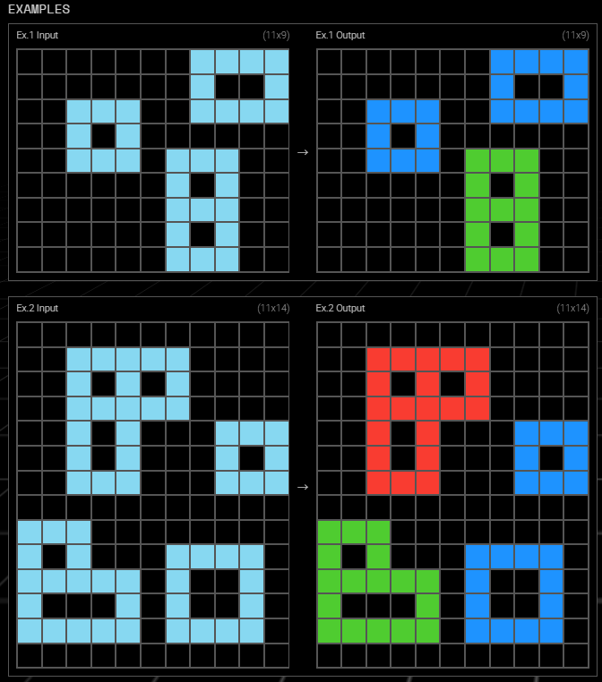
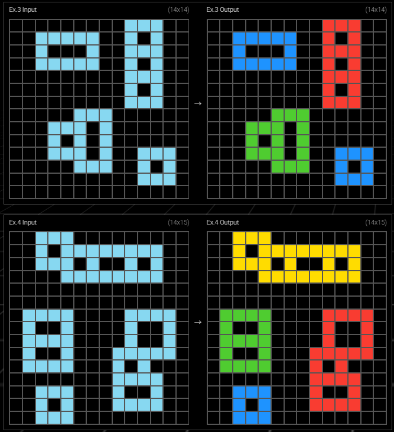
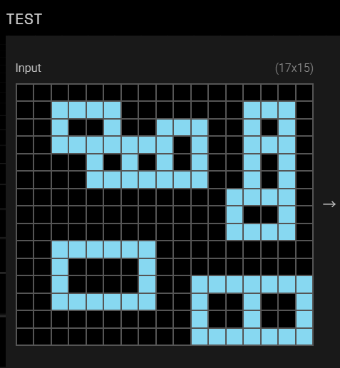
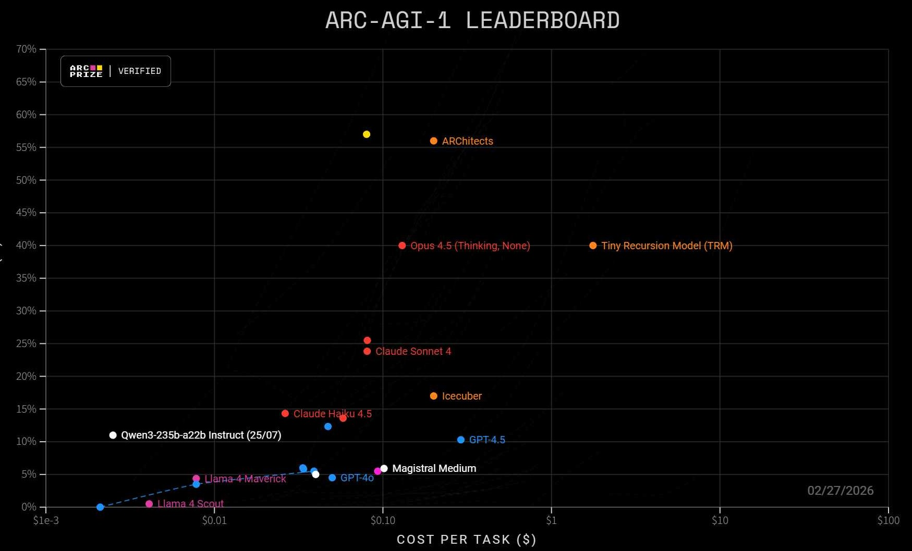


## 概况 Introduction

 



```json
{"train": [{"input": [
  [0, 0, 0, 0, 0, 0, 0, 8, 8, 8, 8], 
  [0, 0, 0, 0, 0, 0, 0, 8, 0, 0, 8], 
  [0, 0, 8, 8, 8, 0, 0, 8, 8, 8, 8], 
  [0, 0, 8, 0, 8, 0, 0, 0, 0, 0, 0], 
  [0, 0, 8, 8, 8, 0, 8, 8, 8, 0, 0], 
  [0, 0, 0, 0, 0, 0, 8, 0, 8, 0, 0], 
  [0, 0, 0, 0, 0, 0, 8, 8, 8, 0, 0], 
  [0, 0, 0, 0, 0, 0, 8, 0, 8, 0, 0], 
  [0, 0, 0, 0, 0, 0, 8, 8, 8, 0, 0]], 
  "output": [
  [0, 0, 0, 0, 0, 0, 0, 1, 1, 1, 1], 
  [0, 0, 0, 0, 0, 0, 0, 1, 0, 0, 1], 
  [0, 0, 1, 1, 1, 0, 0, 1, 1, 1, 1], 
  [0, 0, 1, 0, 1, 0, 0, 0, 0, 0, 0], 
  [0, 0, 1, 1, 1, 0, 3, 3, 3, 0, 0], 
  [0, 0, 0, 0, 0, 0, 3, 0, 3, 0, 0], 
  [0, 0, 0, 0, 0, 0, 3, 3, 3, 0, 0], 
  [0, 0, 0, 0, 0, 0, 3, 0, 3, 0, 0], 
  [0, 0, 0, 0, 0, 0, 3, 3, 3, 0, 0]]},
  {"input": [..], "output": [..]}, ..
  ],
  "test": [{"input": [..], "output": [..]}]}
```



in official kaggle contest accuracy is based on pass@2 (my transf_sampling on eval gets 19.5%)

ARC3 is much more different from ARC1/2, stressing online learning and is like (meta-)rl

Engeering keys: data, fine-tuning, post-processing

## 数据增强 Data Augmentation

扩充任务方法：

- **geometric transformations and color permutations**
- program synthesis, e.g. ReARC
- llm generation, e.g. NVARC

Dataset:

- ARC-AGI1: eval 400, train 1k
- ConceptARC: 41k
- MiniARC: 37k
- ReARC: 102k

**total training set 180.97k tasks**, mostly have more pairs than evaluation tasks

## 微调 Fine-tuning

基座模型：

- Mistral-7B-Instruct-v0.3
- DeepSeek-R1-Distill-Qwen-7B
- Qwen3-4B-Thinking-2507
- Llama-3.2-3B

综合基准效果和成本考虑选择 Qwen3-4B-Thinking-2507

**baseline: 2%** (on eval, the same below)

Serialization:

- 16 tokens vocab and a short fixed form, max\_len is 931

  each pair: `<|im_start|>userĊ{grid_in}<|im_end|><|im_start|>assistantĊ{grid_out}<|im_end|>`

- qwen use Ċ unicode to represent \n, and Ċ instead of \n has better outcomes (maybe \n's other pretrained meanings obscure the grid meaning)

**LoRA: 11.25%** qkvogud, r=64, alpha=32, dropout=0.05, lr=1e-4, epoch=3, batch\_size=4, grad\_accum=2

bf16, nf4 quant, 3.18% params, global\_step=67866, 61.87h on 1 A100 GPU (2.437 samples per sec)

## 推理优化 Post-Training Optimization

generate candidates then select the best-scored

**dfs+prune: 12.5%** (ARChitect original), cut off the sampled token path when accumulated prob<0.05

surpass 20% on training set

**bfs or beam: roughly the same 12.5%**

**ent\_trigger: 14.75%**, sample two different answers/paths at first, then compute next-token entropy at every token, rollout/sample another path(push into stack) from the position meeting **large entropy or small concentration ratio** with other top\_k next-tokens (prune also)

Meanwhile the searching process is restricted by max\_rollouts and trigger\_num for each path to control cost. If no candidates(all pruned) it will retry with looser conditions

**transf\_sampling: 16.5% direct and effective**

sample an answer (then transf back) for every geo transf and color perm on the task

**pass@16: 23.75%** (transf\_sampling, the same below), pass@16 of ent\_trigger is roughly 16%

**pass@8: 20.75%** 近似正确的答案基本聚集在分数前部（但难以细分出第一）

another evaluation shows pass@1/2/4/8/16 16.5%/19.5%/21%/22.3%/22.3%

**pass@32: 36.6%** (on train)

**pass@8: 30.3%** (on train)

Observation:

- 部分题目正确答案的路径概率非常低，实际上完全没学会
  
  能搜出来的一般打分也靠前，但不一定第一 pass@8 $\approx$ pass@16

  key factor: LoRA rank needs to be larger

- hit rate of candidates 相对而言较高，esp. raises significantly after increasing search amount, >40% estimated

  Select the best answer is far more difficult (future direction)

- **stack not queue**: because of better outcomes

  Searching low-prob paths first allows for earlier pruning, otherwise computational limits may be reached before high-prob branches are fully searched, and it may lead to insufficient exploration

- ent\_trigger is more efficient than original dfs (dfs needs to search more nodes to cover same candidates)

- cut tokenizer (train embeddings and lm\_head) for efficiency because saving output\_scores (on GPU and is finally copied to CPU) incurs substantial overhead

- other GPU-CPU optim: (real coding agent fault, may due to poor prompt)

  - length by `input_ids.size(1)`(in-place) not `input_ids[0].tolist()` then len
  - 计算指定答案的 log\_prob 应只需一次前向生成得到所有 logits

- in theory when generating cands only problem part's KV cache can be optimized so not very effective

**Repeat: pass@16 23.45%**，基本无提升反而略差

effectiveness relies on:

- earlier tokens can observe later tokens thru repeat
- repeated patterns usually receive higher weight from attention mechanisms (anaphora resolution, but may be over-focus "aaaa...")
- same semantic information appearing at different absolute positions helps focusing on the content

而任务里的 input-output pairs 大幅消解了影响，如果仅在各 grid 处马上重复则难以利用训练知识

## 强化训练 SDPO

$\mathcal{L}\_{\mathrm{SDPO}}(\theta):=\sum\_t \operatorname{KL}\left(\pi\_\theta\left(\cdot \mid x, y\_{<t}\right) \| \operatorname{stopgrad}\left(\pi\_\theta\left(\cdot \mid x, f, y\_{<t}\right)\right)\right)$, where $f$ is rich feedback from env. Stopgrad to avoid teacher being affected by student, and has no trust region constraint since teacher and student share the same model which gives a natural regularization effect（论文里稳定化技术提到对教师指数移动平均或围绕 ref 教师分布施加约束）

integrated into RLVR by $A\_{i, t}\left(\hat{y}\_{i, t}\right)=\log \frac{\pi\_\theta\left(\hat{y}\_{i, t} \mid x, f\_i, y\_{i,<t}\right)}{\pi\_\theta\left(\hat{y}\_{i, t} \mid x, y\_{i,<t}\right)}$

here use ground truth as $f$, **student\_prompt = question + wrong, teacher\_prompt = question + gt + test\_input + wrong**, and loss is computed on wrong（由于 coverage 不高且缺乏证据，不用 self topk-choice SDPO）

**only on tasks that candidates include gt**, if oracle:

- becomes supervised learning or offline distillation not rl, 经实验 SFT(on self-teacher's correct answer) 更差
- can not prove that self-teaching enhances capability
- may leads to relying hindsight(over-confident) and forgetting

Properties:

- comparation: SFT wastes wrong samples and memorize correct answers by rote, GRPO uses 0/1 reward and has no token-level credit assignment while SDPO is even logit-level

  sft 不知道错在哪，grpo 没有精细的部分模式奖惩

- can just leverage the cand sets generated earlier at pass@32, **total trainable examples 4.02k**

**pass@1/2/4/8/16 17%/22%/25.5%/27.5%/28%** (on eval 200 tasks) compared to 20.75%/23.75% @8/16

batch\_size=2, lr=1e-4, top\_k=16, qkvogud, r=32, alpha=32, dropout=0.05, grad\_accum=2

amp bf16, 1.62% params, max\_step=5660, <2h on 1 A100 GPU (due to restricted resources)

(pass@1/2/4/8/16 16.8%/21%/23.5%/24.5%/24.5% when max\_steps=1000, lr=5e-5, top\_k=64)

can find the correct answer to more questions after little training. Though from statistical view (assuming that the correctness of each task’s answer follows an i.i.d. sampling process, approx z‑test $z = \frac{p_1 - p_2}{\sqrt{ \frac{p_1(1-p_1) + p_2(1-p_2)}{n} }}$) it is not significant (z=1.37, p=0.17 for pass@16, z=1.82, p=0.025 for pass@8)
