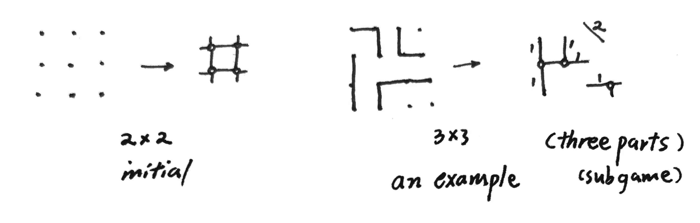


### 划线围格

这是一个曾在我高中时流行的简单的纸笔小游戏。经过搜索叫做点格棋 Dots and Boxes，由法国数学家Lucas在1891年推出（原本以为没名字，自己取了中文名划线围格和英文名Grid Enclosing）（失望的发现已经是一个经典的Computer Games项目了，但还是坚持完成本篇吧）。游戏进程如下：有 $n \times n$ 大小的网格，双方玩家互相沿着某一条直线划线（一次划一个单位小格的边），当某块区域被合拢围起来时，内部格数归最后一笔合拢的玩家所有，此时该玩家必须再走一步棋（直至没有产生围格为止）。到最后棋面被完全瓜分成若干个完整区域（最外的边线也要一笔笔划上），计算玩家得分（所占格数）判断胜利。

这里简单介绍我的一小部分想法：将游戏局面转化为连接图。（便于计算机存储、处理并设计算法；目前网上可以搜到最好的程序是alpha-beta search）

从每个边界开口进去，经过所有奇性格（四边中只有两条边被划过的格子），到达一处格子（小于等于一条边被划过的），称为中心格。中心格用圈表示，圈之间用直线连接，线旁标上连接管的格子长度（0长可不写）。每一步都是cut off一段直线并把其上数字归为己有。若一个圈只有两条线连接了，它将消失并与两边的线联合起来成为新的更长的管。

*（右上角笔误，斜线上写1）*

（原谅我有点懒，这之中还有很多定义和定理要详细证明，有时间单独发到research栏目里）

（图论及其矩阵的方式并不是很好，鉴于节点会消灭...）

肯定有人想，这个想法很不错啊，为什么不继续？原因同开头——已经有人做过了！Elwyn R. Berlekamp 在[1]的前言中提到，自己在小时候便对点格棋产生了极大的兴趣，随后在当大学教授期间与学生Conway合作共同研究了相关理论[1] [2]。（有时间我再比较一下理论的异同）

**reference**

[1] Berlekamp, Elwyn R. *The dots and boxes game: sophisticated child's play*. CRC Press, 2000.

[2] Berlekamp, Elwyn R., John H. Conway, and Richard K. Guy. *Winning Ways for Your Mathematical Plays, Volume 3*. CRC Press, 2018.

[3] Barker, Joseph, and Richard Korf. "Solving dots-and-boxes." *Proceedings of the AAAI Conference on Artificial Intelligence*. Vol. 26. No. 1. 2012.

[4] Buchin, Kevin, et al. "Dots & boxes is pspace-complete." *arXiv preprint arXiv:2105.02837* (2021).

**23.7.1 插播：My Own New Conclusion !**

**In $n \times n$ dots & boxes game, Zermelo's Theorem can be specified to:
The first player wins or at least draws if $n$ is even;
The second player wins if $n$ is odd.**

(Whole proof will be uploaded at proper time.)