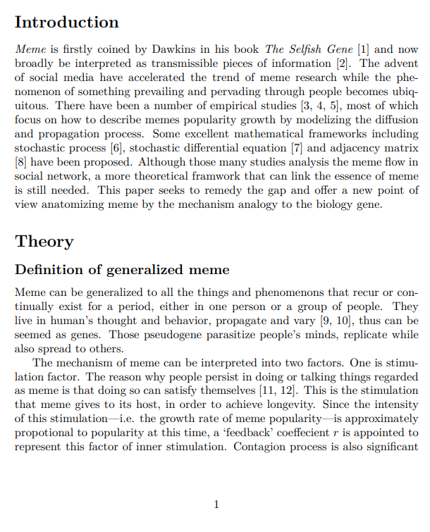


### 流行的生命机制

我想用一个 Prevalence 流行这个名词来一网打尽所有与人有关会重复出现的事物。后来想起模因论本身就比较契合——可以仿照从生命的角度来解释，但概念可以推的比 meme 更广泛一点，不仅仅是从一个人脑复制到另一个人脑的文化或语言事物（韦氏词典 meme: an idea, behavior, style, or usage that spreads from one person to another in a culture）。 比如一个人经常使用某个梗或沉迷某件事，他会在时间维度上呈现一个流行从兴起到爆发再到衰落的过程，不妨也认为是某种‘流行基因’的增殖。例子可以非常广泛，包括但不限于一项新技术的传播、一首榜单流行歌曲、一个微博热搜、以及传统模因论域中的如 ikun……

模因论指出的三要素为保真性 Fidelity、长寿性 longevity、多产性 Fecundity。流行依靠复制而生存，从这点来说其繁殖和生存，与一般生物不同，是强正相关的。但这个繁殖亦即传播有两种，一是本人的重复，二是人与人之间的传播。保真性并不排斥变异，相反流行的不断筛选演变的包装也是其作为生命的一个体现。说是生命的角度本质上仍然源于其繁衍具有生物的形态和过程——如单流行下的逻辑斯蒂方程。同理还可以研究多个流行的竞争和迭代，类似于生态系统中种群的竞争和共存；纳入群体传播的因素和一些统计学上的假定还可以研究群体流行的强度分布、方差的演变，回归得到不同社群的因子参数等等。需要指出的是，完整的演变还应描述种群的衰退，这通常由于时间增长后其激励不足（腻烦）即正反馈下降，从而热搜下跌，流行退流。

（*实证研究也尚未做。下面是一个简单的开头*）

.png)

**References**

[1] Richard Dawkins. The selfish gene. Oxford university press, 2016. 

[2] Kleber A. Oliveira. Modelling meme popularity with networks. page 3558205 Bytes, 2023. Artwork Size: 3558205 Bytes Publisher: University of Limerick. 

[3] Daniele Notarmuzi, Claudio Castellano, Alessandro Flammini, Dario Mazzilli, and Filippo Radicchi. Universality, criticality and complexity of information propagation in social media. Nature communications, 13(1):1308, 2022. ISBN: 2041-1723 Publisher: Nature Publishing Group UK London. 

[4] Justin Cheng, Lada A. Adamic, P. Alex Dow, Jon Kleinberg, and Jure Leskovec. Can Cascades be Predicted? In Proceedings of the 23rd international conference on World wide web, pages 925–936, April 2014. arXiv:1403.4608 [physics, stat]. 

[5] Emilio Ferrara, Mohsen JafariAsbagh, Onur Varol, Vahed Qazvinian, Filippo Menczer, and Alessandro Flammini. Clustering Memes in Social Media. In Proceedings of the 2013 IEEE/ACM International Conference on Advances in Social Networks Analysis and Mining, pages 548–555, August 2013. arXiv:1310.2665 [physics]. 

[6] Kleber A. Oliveira, Samuel Unicomb, and James P. Gleeson. Diffusion approximation of a network model of meme popularity, June 2022. arXiv:2206.10960 [physics]. 

[7] Jose M. Miotto, Holger Kantz, and Eduardo G. Altmann. Stochastic dynamics and the predictability of big hits in online videos. Physical Review E, 95(3):032311, March 2017. arXiv:1609.06399 [nlin, physics:physics]. 

[8] Joseph D O’Brien, Ioannis K Dassios, and James P Gleeson. Spreading of memes on multiplex networks. New Journal of Physics, 21(2):025001, February 2019. 

[9] Susan Blackmore. Meme, myself, I. New Scientist, 13:40–44, 1999. 5 

[10] Alice Marwick. Memes. Contexts, 12(4):12–13, 2013. ISBN: 1536-5042 Publisher: SAGE Publications Sage CA: Los Angeles, CA. 

[11] Richard J. Pech. Memes and cognitive hardwiring: why are some memes more successful than others? European Journal of Innovation Management, 6(3):173–181, January 2003. Publisher: MCB UP Ltd. 

[12] Michele Knobel and Colin Lankshear. Online memes, affinities, and cultural production. A new literacies sampler, 29:199–227, 2007. Publisher: New York.