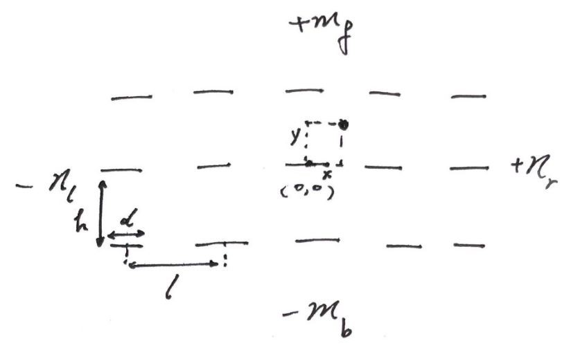


### 军训偷懒学

欢迎你来看这篇军训偷懒指导！我想你心里已经为偷懒找好了理由甚至做出了哲学分析，那么我们这里抛开事实态度不谈，从技术的角度试着研究一下。

*原则：敌进我退，敌退我进。*

按照孙子“不战而屈人之兵”的理论，能在约架前一天用泥头车创死对方就绝不应约，能在军训训练前解决军训就绝不留到上场。应充分阅读请假和减训规则并最大化漏洞，还可以在训练中场休息时以各种名义一去不复返。

而训练过程中我将内容其分为三个门类：

*军训技巧学*：1. 使用厚厚的鞋垫或用来垫的物体，还可以使用硬硬的东西避免踩鞋 2. 前倾，但是动态——指可以来回前后倾倒，甚至引发教官对你的关心 3. 利用观测漏洞动手动脚，例如双脚向外折开休息 4. 表现出很严肃对待但实在很愚笨的样子 5. 喊话时滥竽充数，即挤眉弄眼扯喉咙，表现出声嘶力竭的样子

*军训观测学*：来考虑一下当我们视野里没有教官的时候是否可以乱动。

.jpg)

*（人眼具有约$\it 120^{\circ}$的视野张角）*

先假设所有人站成一个标准的方阵。我们把每个人看成一条线光源：



（共 $m\_f+m\_b+1$ 行 $n\_l+n\_r+1$ 列）

简化起见我们认为教官没有离方队那么近，其视野能够覆盖整个方队且面向方队，即能捕捉到视野内的动态。鉴于光路可逆，我们不予讨论前向$120^{\circ}$内的视角。每个线光源的两端与我们观测点 $(x, y)$ 的连线的角度之间即是遮挡域，我们逐一计算出各个人的遮挡域并取出交集。

计算过程以伪代码展示：

```
for i,j in (-n\_l,-1)|(1,n\_r),(-m\_b,-1)|(1,m\_f): # 遍历其他所有人
theta\_r = atan2(j*h-y,i*l+d/2-x) # 四象限反正切(0-2pi)
theta\_l = atan2(j*h-y,i*l-d/2-x)
thetas.append([theta\_l,theta\_r])

thetas = integrate(thetas)
prob = (countangle(thetas,0,pi/6)+countangle(thetas,5*pi/6,2*pi))*3/(4*pi) # 计算平均概率

func integrate(): # 合并有重叠的区间
sort the theta intervals by the left side and then exam if there is overlapping and integrate each by each.

func countangle(): # 计算在指定范围内的区间们的总长
calculate the length of each interval and add then together.
```

（可以预见，在具有一定人数且人靠内部的情况下，偷偷动动手是大概率不会发现的。一般教官要求的参数：$h=l=75cm$（左右转后一致），$l-d = 10cm\ 即\ d=65cm$。为了方便继续研究，$(x,y)$ 用以表示相对人中心一定偏移处的动作影响，如左手在腿边拨动手指应取 $(-32.5,0)$）

可是我们知道很多时候是会被发现的，尤其像擦汗抓痒。一是这些动作持续时间长，风险在增加；二是幅度大，除了动动手指可能没什么影响，其他很多动作会对整个躯体带来震动，比如头部会起伏。我们再来考虑这个维度。

方法非常简单，我们只需要把参数换成脑袋的宽度和距离即可。同时部分线光源的区间由于比被观测者矮 $H(i,j) \le H(0,0)$ 应删去。（不妨设一个正态分布，可以代入自己身高得到一个概率$p$也可以综合起来就是$1/2$）

准确的说，不同高度下这个剖面的参数都不相同，且应考虑视线斜向下的遮挡问题，但这个略显细节。还有一些数学上的操作和讨论，例如方阵不标准，即 $(il+\delta\_1,jh+\delta\_2)$，在此不做赘述。

为一个简单的例子算个值：我的位置在 $15\times 15$ 的方阵中的第 $3$ 行第 $7$ 列，那么当正前方没看到教官时动一动大概有 $45.5\%$ 的概率被抓。（假设我是矮子即没有删人，代码见页末）

（需要指出这里最大的疏忽：教官的概率空间是怎么样的？真的是以我观测的角度均匀分布的吗？）

*军训伪装学*：理论上只要报告身体不适即可休息，但我们来假想一种不允许这样子干的疯狂训练。例如你可以双腿一软，缓缓躺倒或跪下，闭上眼睛或大声喘气……

最后再给各位支上几招（不负责噢）：

*引蛇出洞/团伙作案*：主动乱动或不舒服，吸引全部教官的注意力，为大家争取宝贵时间。多个教官可能需要逐个解决，形式不必拘泥，也可以’猜猜我是谁‘并从背后蒙住其眼睛。

*狐假虎威*：趁教官不注意模仿其口气下’坐！‘的命令，达到休息目的。或购买一只营长使用的哨子，趁大家不注意哔哔吹响，组织集体大休息。

*鱼目混珠*：购买一套跟教官穿的一模一样的军装，扮成教官，混入队伍并带领你的空气方队不知所踪。

---

[上文程序](./23.9.1.zip)