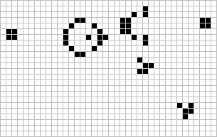


### 新生命游戏

Conway 的生命游戏是一个零玩家的元胞自动机（cellular automata）。每个单元格即一个细胞，其有生死两种状态； 当细胞的周围少于两个活细胞时，其会死于孤立；周围多于三个活细胞时，其会死于拥挤；两个或三个时能继续存活；当死细胞周围刚好有三个活细胞时，其会被繁殖激活。

*（涌现出了的各式各样的模式，上图为滑翔者枪 glider gun）*

*（有非常多网页实现此程序，推荐一个 conwaylife.com）*

（灵感来自军训时的迷彩服）我想把生命游戏扩展到多种类（部落），它们以不同颜色表示。下面以双色为例。

.png)

除了单色下已有的模式，列举一个新发现的模式：

.gif)

（$2\times2$ 方块具有很强的稳定性，几乎不会被吞噬；吐司、灯塔、蜂巢等稳定结构均可以充当飞船反射镜，将另一个颜色的宇宙飞船以 $45^{\circ}$ 角反弹为滑翔机，或称拓荒者；风车、四风车均能被拓荒者侵占）

（将规则中允许 cell that has 4 living same-color cells around keep alive 还能看到领地的城墙、界河等等现象）

可能还具有一些研究和现实的意义，在此按下不表。程序附于页末（py tk库制作）。

这里再发散一下，其实我们还可以多样化。棋盘可以使用各种密铺图形，它们不必相同，甚至可以模拟各种地理环境；规则也可以因此更加复杂，并向现实匹配；还可以增高维度，变成立方的生命游戏……

.png)

*（一种不完全正镶嵌——中间的大多边形会是城堡吗？）*

---

下载：[新生命游戏(双色)](./23.9.8.zip)

*界面如下：*

.png)