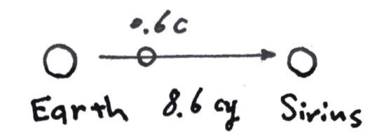


### 天体金融学

（这个名字大概也不恰当……呃但是我总是沿用最开始的称呼）（其实这周的内容是某种异世界的构想……在我能搜索到的范围内未发现有人研究了这方面嘎嘎）

假设未来的有一天人类已经发展到了整个庞大的星系，星球相互之间的距离甚至要以光年来计算，同时人类开发出了可以与光速量级比拟的高速飞船进行交通；自然会出现很多跨星公司，也需要一个星际的金融系统。让我们来明确一下其运行的逻辑。

首先需要刻画一下这个星际系统。我想所有人类社会依存或居住的地方都可以分为三类状态：静止 static，旋转 rotating，交通 transporting（即从A星系往B星系去）。（总之不能无限制跑远吧）（可以相对于自身所处的参考系而言，也可以统一对于如地球而言）

假设琉球 Rover 负责在地球 Earth 和天狼星 Sirius 之间往复运输，它可能是个飞船（那也应该是相当巨大的社会生态系统了），或者人们已经能够熟练的操纵星球来回流浪……

鉴于相对论的效应，不同速度下的时间流逝是不同的。如果将来的体系仍以地球为中心（也许不是了），我们可以这样来表示 Rover 系的状态：用运行正方向在天球上的指向加上其速度 $\gamma$ 值，Sirius $\gamma=\frac{5}{4}$（或 $\alpha\ CMa\ 1.25$）；准确可写为 (06h45m08.9173s, −16°42′58.017″, 1.25)，使用赤经赤纬（GEI Celestial Coordinates）。不同星球上都有着自己正常运转的社会，有自己正常的时间历法，但为了自由大市场，均统一采用年-月-日-时-分-秒的形式。一般来说可以从出发星体处共时开始用历，但重要的只是差值。在同一个系内，各星理论上应同时为好（可以尽量协调，比如成立 ITCA 啥的——指 Interstellar Time-Coordinating Association）。

既然物理定律在所有参考系皆等价成立，不妨猜想所有星球都有相近的生产能力和无风险利率 $r$ 。即使我们的证券等金融手段为本星结算，套利也会出现：（$T = 2*8.6/0.6 = 28.67$）

我们在 Rover 出发时在 Earth 买入并在 Rover 卖出等额的零息债，无论我本人跟随 Rover 还是留在 Earth，在其回来的时候必然存在 $e^{rT}$ 和 $e^{r\frac{T}{\gamma}}$ 的差别。

解决方法可以是考虑货币的作用。我们假设存在美元 USD 和琉球美元 RVD。其汇率 $e$ 在不同时刻会不同，以使上述利差为 0。具体来说，应有 $\frac{e\_t}{e\_0} = e^{-r(1-\frac{1}{\gamma})}$，$e\_t$ 为 $t$ 时刻美元的间接汇率。

广泛地，我们写

$$
rt + \epsilon -\epsilon\_0 = Const
$$

其中 $\epsilon$ 为间接对数汇率 $\ln e$，$\epsilon\_0$ 为其初值。$Const$ 表明在不同系下，其基准利率 $r$、本征时间 $t$ 和本币汇率 $\epsilon$ （可统一兑一参考货币如USD）应满足如上恒等关系。

即使异星结算/异系结算 off-planet/off-system settlement，我们在离星货币市场中仍然近似保有此关系。

需要指出的是，就像利率平价关系一样，这个等式只在理想市场情形下成立，真实世界仍然受到交易成本、外汇管制等众多因素的影响，不可能三角仍然存在。

取微分，贴水率 Agio 定义为

$$
a \equiv -\frac{d\epsilon(t)}{dt} = r(1-\frac{d\tau}{dt})
$$

那么上文所述的意思就是 $e$ 会受到汇率贴水率折现 $e(t) = e(0) e^{-at}$。（$\tau$ 为外币本征时）

有人可能会质疑这里等式的不对称性，实则与双生子佯谬同工异曲，不再赘述。

同理，我们看一个绕主星旋转的伴星系统。Schwarzschild 线元

$$
ds^2=-(1-\frac{2M}{R})dt^2+\frac{1}{1-2M/R}dR^2+R^2d\theta^2+R^2sin^2\theta d\varphi^2
$$

不难得到质点运动方程之一

$$
E = \frac{dt}{d\tau} (1-\frac{2M}{R})
$$

则

$$
a = r(-\frac{2M}{RE}+\frac{1}{E}-1)
$$

其中 $E$ 守恒，为单位质量的（总）能量，几何单位制。更复杂或一般的情况下则直接对 $a$ 沿世界线积分。

再举一个例子，假设我们在 Earth 上的 NYSE 里购买了 Interstellar Inc. 的股票期权，并将交割其在 SUSE（天狼星城证券交易所 Siriurb Stock Exchange，Sirius $\gamma$）的标的。

此时的无套利原理应作

$$
H^1\_T(P\_1) =  H^2\_T(P\_2) - \epsilon\_{12}(T\_1) \Rightarrow \\\
dH^1\_t(P\_1) + r\_1dt\_1 = dH^2\_t(P\_2) +r\_2dt\_2
$$

其中的 $H = \ln V(x,t)$ 为对数价值。$P\_1$ 可代入我们的 European Call，$P\_2$ 为 $B\_2$  和 $S\_2$ 的一个 Portfolio，$r\_1=r\_2=r$；利用上式，可以如法炮制推导出新版的 Relativistic Black-Scholes 方程

$$
\gamma \frac{\partial V}{\partial t} + rS\frac{\partial V}{\partial x} + \frac{1}{2} \gamma \sigma^2 S^2 \frac{\partial^2 V}{\partial x^2} +(\gamma-2)rV = 0
$$

若令 $\gamma = 1$，方程退化为我们熟知的样子。结合边界条件，解得

$$
\begin{aligned}
V(S,t) & = e^{a(T-t)}(SN(h\_1) - Ke^{-\frac{r}{\gamma}(T-t)}N(h\_2))\\\
h\_1 & = \frac{ ln(\frac{S}{K}) + (\frac{r}{\gamma} + \frac{1}{2} \sigma^2) (T-t)} {\sigma \sqrt{T-t}}\\\
h\_2 & = h\_1 - \sigma\sqrt{T-t}
\end{aligned}
$$
