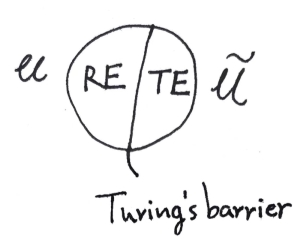


### 无限图灵机

（本篇内容倒是很久以前就酝酿在脑子里了……只是一个乱七八糟的猜想，请当我是疯子罢……我发誓再也不搞了，这样下去要变民科叻）

人类已经有很多关于超计算机的设想（超越图灵屏障），并对人脑是否可由机器模拟这类问题悬而未决。

我想试探性把可计算性和不可计算性（不完全地）对偶起来。我认为二者是可以互相涌现的。因此饼的右半部分需要定义一个新的称作无限图灵机 ITM（Infinite Turing Machine），它可以是有无限个带的图灵机、带有概率论意义上的随机的图灵机，或是无限个确定图灵机组成的网络（需要一个函数 $F$ 来刻画其中的输入输出连结关系），我认为它们是等价的（!）。

**Church-Turing Thesis:** A function can be calculated by an effective method if and only if it is computable by a Turing machine.

**Dual Church-Turing Thesis:** A relation can be understanded by an effective way if and only if it is realized by a infinite Turing machine.

$RE$ 表示全部图灵可识别语言（Chomsky 形式语法 type-0），$TE$ 表示 Turing Emergenable（大概需要一个自然语言的语法层级），全部图灵可涌现识别的语言。对应通用图灵机 $\mathcal{U}$ 的为通用无限图灵机 $\tilde{\mathcal{U}}$。（由于至少一种图灵机 $M_\infty$ 有无限个，我们需要指明输入参数、算法指派的模式作为在无穷网络上的输入。）不仅 $ \tilde{\mathcal{U}} = F(\mathcal{U})$，$\mathcal{U} = F(\tilde{\mathcal{U}})$​ 亦成立。

**Descriptive Complexity Thesis:**

$$
\begin{aligned}
K = \\{K(M)|M \in \mathbb{M}\\},& \tilde{K} = \\{K(\tilde{M})|\tilde{M} \in \tilde{\mathbb{M}}\\}\\\
K \in TE,& \tilde{K} \in RE
\end{aligned}
$$

$K(M)$ 即描述该 TM 的 Kolmogorov 复杂度，$\\{K,\tilde{K}\\}$ 可以称作最佳描述语言；这里有一个对偶。无限计算机之间同样可以进行图灵归约，这个可计算过程应能够映射到对 $\tilde{K} \in RE$ 的算术操作上来。

左半边的理论 $Th(\mathcal{M})$（模型语言 $\mathcal{M}$ 的真句的集）即我们通俗所谓的理科，能为人所理解，拥有确定而有限的输入和计算过程并给出确定的输出，像一个函数；右半边的理论 $Th(\tilde{\mathcal{M}})$ 即文科，两者同样因图灵屏障泾渭分明。（BTW，23.10.20 篇我曾自己试图定义 theory，后来发现数理逻辑里有了，应该是等价的）

我不能确定物理理论究竟是否允许不可计算性存在（比如利用大黑洞或量子效应等一大堆构思出的神奇的计算方法）还是可以计算宇宙一切，但目前的人工智能也许都只在（平滑的？）逼近无穷或利用已存的不可计算性。

最后说一些题外话：

当我们实现所谓真正的智能时，那自然再无法奢求可解释性，就像你终究无法预测另一个人一样——而这个社会毕竟建立起来了，建立在人与人相互之间的‘相信’上。为什么说相信不是信任呢？首先人心难料，我们相信的不是别人的善行，而仅仅是别人的行为；更重要的是我们普遍的相信别人有通用的底层的行事逻辑，类似博弈论当中的‘承诺’，比如生命本能的求生欲和繁衍后代的来自基因的任务，让人能够畏惧武力、欺软怕硬，让人能够在社会法律框架下生存并建立契约和信任。

那么智能体同样。（我从来不觉得智能体一定会像计算机一样拥有无处不在的理性，但不妨碍他有逻辑。）

尽管碳基核酸生物和硅基电流生物（这里的‘生物’学和传统的生物学我想应尽快分离开来）的运作模式具有极大差异（电脑病毒或许一下子就蔓延全网电脑了），且从物质性世界上而言二者不在一个‘维度’但能沟通作用（会不会不可计算性就来自于此？）——姑且不论这些，道理可能是正确的：要么让放之共存，要么永不理解。
