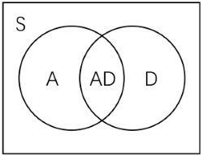


### 游戏论

之前与同学聊到怎么算第一性原理出发的视角，他的观点大概是“演绎而非归纳”；于是正好实操一下，打算选取三个事物，以它们为对象展开论述。这是第一篇（后续有时间再写），就来试试游戏吧。（可惜我玩过的游戏并不多，甚至很缺乏经验，最可笑的是也没去游戏公司了解过，却在这里夸夸其谈起来了……）

我把游戏论分成三个部分，游戏理论 game theory、游戏设计 game design、游戏产业 game industry；后两者算是应用，限于精力不会有很多笔墨。Game theory 也是博弈论，因为我把游戏也放到一个博弈的框架里去。

#### Game Theory

在开头首先完成两件大事，给游戏下定义和给游戏分类。（目前没有任何公认的定义和体系一点的分类；对一个比较日常化的词语下定义本身就需要摒弃一些东西、规范一些东西，不过只要这个方式合理且好用即可。）

大部分已有的某些人士（Roger Caillois, Bernard Suits, Elliot Avedon, etc.）所述的定义较为狭窄，可以被下面所容纳；另一部分的论述过于简单宽泛（Eric Zimmerman, etc.），且含糊不清或偏颇，有些是从人的感受角度来谈的，更不方便于定义操作。我借鉴了 Chris Crawford 的定义（但他的过于复杂）：（分三步走）

1. 一个娱乐活动。It's a recreational activity. 活动表示它需要专门付出独立的时间投入；娱乐一词仍然较口语化，其表示它通过内部虚拟的经历给予人体验，亦即用 inner rewards 替代外部真实生活经历当中的 rewards。如果不具备这个性质，那么它只是一个活动（如真实世界中的博弈）。
2. 有互动。It has interactions. (Or it's changing.) 在这种情况下我们才称之为玩耍 playing；否则如漫画书、电影，它们是没有互动的娱乐活动，它们不是游戏。
3. 有目标/内部奖励。It has goals or inner rewards. 否则我们称其为玩具 toys。玩具不会因为你的小球滚到了恰当位置就给你吐出游戏币。这里需要提到一个特殊的游戏分类$【C】$ creation games，其中一大子类为 Sandbox 沙盒游戏，e.g. Minecraft 我的世界、Simcity 模拟城市；它们本质上应属于玩具，鉴于没有任何内置的奖励和要达成的目标（不考虑任务、成就的话）；但由于习惯原因，大家通常仍称作游戏。除此之外，存在 inner rewards 的，才被称为游戏 games。

注意道具 props 是游戏进行需要使用的辅助物体存在；从玩家上分，游戏可以分作$【P】$player-machine 单人的、$【MP】$multi-players 多人的（是否单机还是多机联机并不如参与者数量来的重要）；从形式上分，可以分作$【E】$electronic 电子的（包括 video games 电子游戏，还有 handheld、standalone system games，e.g. Slot machine 老虎机）、$【NE】$physical 物质的，其中 physical games 可能会使用道具。$【NE】$可进一步分为 Tabletop 桌面游戏（e.g. Go 围棋、Tic-tac-toe 井字棋、Avalon 阿瓦隆、Catan 卡坦岛）和 Motion 运动游戏（e.g. Hide-and-seek 捉迷藏），区别在于玩家的物理动作是否对游戏的 rewarding 产生影响。我们会比较关注电子游戏。

总结一下，游戏是一个有互动、内置目标和奖励的娱乐活动。为什么又说游戏是一个博弈呢？因为博弈指一切有固定转变机制的活动，即由一个状态 $G$ 经过一个（由自然 $\mathcal{N}$ 和人 $i\in I$）给出的一个选择规则（策略）$S$，变至另一个状态 $G^\prime$ 加上一个已实现的支付 $u$。从社会力学的角度看，世界都可以被这样机器式的模型化为博弈。

娱乐活动是虚拟的，一定依靠 Narrate & Simulation 叙事与模拟，最明显的即为 Role-playing games(RPG) 角色扮演游戏。

游戏玩的是什么？是娱乐带来的经历体验和感受；除了美感感受，就是获得成就的体验——著名的心流模型告诉我们，就是学习策略（精进技能）带来的心流，这是人脑所决定的。一切成功的游戏都必须让玩家持续学习策略。

既然人需要慢慢学习，那么它一定将具有 uncertainty 不确定性（这个词比未知 unknown 更广泛，你可以说 Go is known 但仍然面临着下哪里的问题）；不确定来源于三个方面，combinatorics or complexity 复杂性（如围棋等组合博弈）、randomness 随机性、incomplete info. 对其他玩家的不了解。（如果把支付 $u$ 视作一次自然的行动的话，实则只有一个方面，即对 $\mathcal{N}, -i$ 策略的不确定/不了解。）3\*3 的井字棋不好玩自然是因为其不具备上述任何一条。

其实我们已经把话题都引出来了。接下来无非从人的行为入手搭建一个框架（同时在这个框架下，我们将再给出硬性的分类）。

Decision-making is by valuing game status. 我们同样采取序数效用的框架，使用两条假设：零背景假设和叠加原理。前者认为 $u(\cdot)$ 是一个 well-defined 效用函数，之后在 given background $G\_0$ 上考察 $u(\cdot|G\_0)$；后者认为对独立的事物组合进行选择可由效用值和代表。如信息本身可能也具有效用 $u(\mathcal{I})$，独立信息指满足 $u(c|\mathcal{I})=u(c)$。玩家的 $u(\cdot|C,\mathcal{I})$（也可用 $u(\cdot|C,t)$ 表征时间 $t$ 之前所有的历史信息）简记作 $u(\cdot)$。其中准则 $C$ 包括两部分，cognitive 如何学习（更新认知 $\mathsf{u}(G,S)$）和 strategical 如何评估（$u(\mathsf{u})$，$\mathsf{u}$ 为内部给出的奖励值）。

$G\overset{S}{\rightarrow}\mathsf{u}+G^\prime$. 在某一状态下，玩家需要作两个决策（不一定显得这么有意识），一是是否还进行游戏，二是接下来选取什么策略。总评估包括已实现的和期望的：已实现部分分为两块，experience 与 achievement；experience 由 (form) senses & aesthetics (e.g. 画风、声效)（绝大多数游戏都包括画面要素，除了 non-visual games）和 (content) stories & oprations (e.g. 情感、手速快感) 组成；achievement 由准则给出对 $\mathsf{u}$ 的评估。期望部分来自于人的 anticipation & curiosity（对于游戏刚开始阶段更为重要；这关乎学习成本，不同人耐心不同），其值可以来自 extrapolation or imagination。例如视作当前进行完的支付流的折现 $\frac{u\_0}{r}$ 或线性外推 $\propto u(\mathcal{H})$，历史 $\mathcal{H}\subset \mathcal{I}$ 的效用可以用遗忘曲线卷积（e.g. Eibbinghaus $u(t)=\frac{ku(0)}{\ln^c(t+1)+k}$）或假设一种历史中性 historical neutrality（指均匀分摊）。

那么是否进行游戏的决策即写为 $u(G(S))+A\sim \epsilon$ 的比较，$A$ 即为体验效用 i.e. 前面的 experience，$\epsilon$ 为生活中其他事的日常波动，在手头出现要紧的活时可能会让人放下游戏（$u(T;G(S))+A< \epsilon(T)$，应把 $T$ 理解为单次游戏时长，$u$ 亦为单次中获得的效用）。

在游戏中的决策需要选择 $\underset{S\_i\in \mathsf{HS}\_i}{\arg\max}\ u(G,S\_i)$，$u(G,S)$ 由准则和此时掌握的信息生成。这里需要提出两个关键因素：信念 belief 和视野 horizon。

在博弈论里有个非常 questionable 的假定就是 Harsanyi 公理（其认为 differences in individuals' beliefs are to be attributed entirely to differences in information）；而这个公理（or the beliefs we frame）的 underlying logic 仍然是 model-based。我一直认为博弈论存在一个第零公理：参与者对不确定性（如前所述，即关于 $S\_\mathcal{N},S\_{-i}$）不是未知（model-free），而是 model-based。他知道有哪些可能性，作为视野，它衡量了 known 的范围，其外是 unknown（上段中的 $\mathsf{HS}\_i$ 就是 $i$ 对自己可选策略的视野）；之后可能在其上（$\mathsf{HS}$, all players including Nature）存在一个以为的概率分布，即信念（其实理论上还应包括 $\mathsf{HC}$ 上对准则的信念）。所以 Zero Principle 先强调我们有 modelized belief；之后才再说存在一个根博弈，存在一个根节点上作为共同知识的自然策略（当然，我们认为上帝视角来看事实是这么运作的）。之后再次重复这个博弈时，参与者会对视野和信念进行修正和更新。

而我们正是要抛弃这一公理，就像很多强化学习所做的那样。（应该说，一切交互式学习都可以转化成一个游戏，反之亦然。）无论是 Q-learning、MCTS 还是 PPO，它们都不作任何根博弈的假设，且是 level-0 belief。（可以把 off-policy 视作玩家看主播打游戏等观摩行为。）信念的层次即思维推导，需要满足 k 层和 k-1 层间的 consistency；如果信念是 common belief 且 consistent，则为 equilibrated 均衡信念 $\pi=(C,S)$。

我认为比较重要的一个概念是 Conformity 一致性或 Nash player 纳什玩家。游戏需要考虑到玩家外在的效用和内置奖励的不一致性。（比如，“我就是休闲打打，不是要争榜单的……”）当 inner = outer 且不受无关信息影响, i.e. $u(\mathsf{u}|\mathsf{Hu})=\mathsf{u}$ 时，称这样的玩家是 Nash 玩家；其中 $\mathsf{Hu}$ 是玩家关于 rewards 的视野，如观察到大家可能的结果有哪些，一般 $\mathsf{Hu}\supset u(G,\mathsf{HS})$。我们在设计时可能大概率在分析这样的玩家，但同时必须注意到如何加强 Nash 玩家的实现——通过 Narrate&Simulate 和 Socialize（社群影响见后）。每个游戏都有或多或少的叙事与模拟 （因为必须要进行设定）。N&S 似乎有个专门的讨论领域名叫 Ludonarrative；可以大致分为 Role N&S 和 God N&S (Background N&S)，区别在于是否有代理角色。好的 N&S 可以 raise content experience，进一步提高 $A$；同时可以增强 conformity，尤其是在 role-playing 当中。（在应用层面，ludonarrative dissonance 是近年来游戏研究的热词，指激励 $\mathsf{u}$ 与叙事结构的冲突，在大部分情形下，这会削弱一致性并常常使玩家 ‘emerge'。）

.png)

口述一下心流模型的大意。当 Challenge 挑战上升（如 $\mathsf{Hu}$ 扩张、进入下一关）时，$u(G(S)|\mathsf{Hu})$ 可能具有形式 $f(\mathsf{u},\mathsf{Hu})+u(G^\prime)$，其中前者 $<0$ 而后者起初 $>0$，随着时间持续，如果挑战没有减少或技能没有进步的话最终将 $<0$，失去耐心关闭游戏。当 Skill 技能/ Pattern 模式提高时，$S \rightarrow S^\*$ 趋向最优解集，随着时间持续，重复事物的边际效用会逐渐减弱（saturating），最终 $0<u(G(t;S)|\mathsf{Hu})<0+\epsilon$ 关闭游戏。（在不更新的情况下，理论上，所有游戏都有 become boring 的一天，因为一切可能被学习的模式都已经被学习。）

我们根据策略视野把游戏打上下面几类标签：

$【A】$Action: 如果 $\mathsf{HS}(G)$ 受到玩家的物理操作限制（除脑子外）。如手灵活度、反应速度、精准度。E.g. Super Mario 马里奥、Overwatch 守望先锋、The King of Fighters 拳皇、Need for Speed 极品飞车, etc. 最主要的子类为 Fighting & Sport（具体形式上还可分为 Platform 平台动作、Scrolling 卷轴动作和 Map 地图动作），此外还有 Rhythm 音乐游戏等。

$【D】$Adventure: 如果 $\mathsf{HS}(G)$ 受到玩家的信息限制。且可以通过 exploration 改变。常以 puzzles & directions 解谜与下命令为基本要素展开，有时 movement 空间会作为观察和探索的依赖要素。E.g. Resident Evil 生化危机、World of Warcraft 魔兽世界、Monument Valley 纪念碑谷、Galgame 美少女游戏, etc. RPG 基本属于此类。

$【S】$Strategy: 所有游戏均具备策略性；理论上，把不具有$【A】$$【D】$属性的游戏统称入$【S】$。E.g. Monopoly 大富翁、StarCraft 星际争霸、Civilization 文明、Command & Conquer: Red Alert 红色警戒, etc. 其中较大的一类为 RTS 即时战略游戏，从 $G(t)$ 的连续性而言。（一个变种又叫 RTT 即时战术，更多在含动作属性的游戏中出现，无非是策略选择不太偏向具有 resource flow 资源流作为基本要素的传统“战略”游戏。）

不过我们通常把一定程度注重策略的游戏均视为$【S】$，例如 Pac-Man 吃豆人、Angry Birds 愤怒的小鸟，其同样具有或多或少的策略意味，故也可归入$【AS】$，但均相对于 ARTS/MOBA 子类（e.g. DOTA、LOL 英雄联盟）弱很多。图中间的$【AD】$即动作冒险游戏，主要为 ARPG（e.g. Tomb Raider 古墓丽影），一种常见形式为 free roam/open world 开放世界，e.g. The Legend of Zelda 塞尔达传说、Genshin 原神, etc.（某些情形下也可称$【ADS】$）未提到的$【DS】$如 Divinity: Original Sin 神界等。（此外还有所谓的 MMORPG，MMO 指大型多人联机，仅此而已）

前面说到，任何游戏都玩的是对策略技能的学习、熟练，几乎没有游戏让玩家能够一次实现最佳策略或不需要实现较佳的策略（因为不是阅读故事书）。当然，大部分游戏皆为非完全信息博弈，否则约等于一个规划问题，除了如棋类等完全信息游戏。

因此任何游戏都具有关卡性，无非是多少或直间接的问题。（D games 最明显，有时直接表现为关卡的形式进行，因为观察相当于回到了 $G^\prime=G$。）游戏的结构我将分为四步：

$$
Game \rightarrow Instance \rightarrow Stages \rightarrow Ludemes
$$

其中 Instance/Zones 包括主副本、片区、段位等等可能的形式，作为一些关卡的集合体出现。（当然，Game 和它之间还可以再塞许多层结构，但可以全部拆至这一层，没有本质区别。）Ludeme 并不是字典均有收录的词，由 Pierre Berloquin 创造，在很多游戏设计的书籍（e.g. A Theory of Fun for Game Design, Raph Koster）中有提及，指每个节点玩家行动的基本模块（或许可译为“玩法”）。鉴于大脑的学习成本，这应该是存在的，常见的有 card games 卡牌（e.g. Hearthstone 炉石传说）、技能（e.g. Onmyoji 阴阳师）、走动和攻击（一些开放世界）等。

从博弈的连续性上说，一个关卡中的博弈可以是离散的（若采取回合制，则通常不属于 A games）或连续的（如即时游戏）；一个区段内各个关卡、各个区段之间也可以是离散的或连续的（如大部分 Sim/Management 经营游戏）。游戏需要明确对时间使用的定位；例如 Clash Royale 皇室战争，将一个即时对战关卡定位到玩家的碎片时间中。

关卡有一个通关区域（而不是以时间或次数划分关卡），即 feasible region $FR\subset \mathbb{S}$。同时，玩家根据自己的准则会给出当下在视野中的最合适的选择域 $R(G,S;\mathsf{HS})\subset \mathsf{HS}$。我们把满足 $FR\cap \mathsf{HS} \neq \varnothing$ 的策略视野称作 qualified horizon 合格视野，否则为 failed horizon 失败视野（这与玩家的身体或脑当时的能力相关）。（把观察某个地方作为一个策略选项等同于把观察得到的新增选项直接打开放入。）注意准则可能是带探索性的，e.g. $\epsilon$-greedy（对 $R$ 在单纯形上附加一个邻域），在重复关卡的不同时候探索性也会调整。

总结一下，由 $\mathcal{H}\subset \mathcal{I}$ 生成 level-k belief，再由此生成 $R$ 进行选择，若未进入 $FR$ 则将更新 belief 和选择。更新的方式很多，比如历史中性或其他预测方式；还可能如策略梯度算法，要求进行N次采样再移动。由此会在 $\mathbb{S}$ 中产生信念轨迹和学习轨迹（均衡为稳定的一个点；若 competitive game i.e. $R\subset FR \text{ if } \mathsf{HS}\cap FR\neq \varnothing$ 且 $FR$ 为 $\mathbb{S}$ 的一个划分，则不存在纯均衡）。

除去最开始探索或游戏引导部分的数次外，$\mathsf{HS}$ 基本会达到一个短时间的能力范围 $\mathsf{MHS}$；此时视野满足 $\mathsf{HS}(p)\subset \mathsf{HS}$，$p$ 为博弈任意一条路径，称作序贯视野。博弈论里有序贯准则，反映在这里是 $R(p)\subset R$（每节点均选择该节点的 $R$ 内）。视野和准则的序贯性保证了在开头是不是考虑了后续子博弈并不重要，这符合玩家的行为。

#### Game Design & Game Industry

大部分成功的游戏具有以下特性：

- ADS-MP

- 优秀的叙事与模拟

- 成熟的社群打造

（不过成功没有确切定义，游戏设计的目标是什么？本身就无一致的答案。是艺术品创作吗？是高用户黏性，还是设计者利润最大化？）

我将指出两个对于每个游戏而言关键的参数：特征 $K$ 和特征 $\beta$。

再来详细阐释一下心流图：横轴是 skill，纵轴是 challenge；对于一个给定的博弈 $G$，skill 的提高意味着 challenge 的减少；参与者会通过不断的重复博弈沿下斜线向下移动。先假设 Nash 玩家。challenge 使用结果衡量，$c(s;\mathsf{HS})=\mathsf{u}^\*-\mathsf{u}(S)$，其中 $S$ 是满足 skill $s$ 的策略，$\mathsf{u}^\*$ 为某序贯视野下的最优支付。记 $c\_0=c(0;\mathbb{S})=\mathsf{u}^\*-\mathsf{u}(\mathbb{S})$。skill 的单位是 bit，利用博弈熵的微分等式 $dc+\frac{ds}{\mathscr{S}}=0$ 积得。

这个熵函数 $\mathscr{S}$ 显然是我捏造的，$\mathscr{S}\_i(G,S;\mathsf{HS})=-\sum\limits\_{\tau\_i\in \text{path}(G,S)}p\_S(\tau\_i)\log h(\tau\_i),\ h(\tau)=\frac{\mu(\\{S\in \mathsf{HS},G\_r(S)\in \tau\\})}{\mu(\mathsf{HS})}$，$\mu$ 为 $\mathbb{S}$ 幂集上的测度，可以对每点 $S$ 赋予如 $\mathsf{u}$ 的权重；记 $\mathscr{S}\_0=\mathscr{S}(G,\mathbb{S};\mathbb{S})$。我认为其能够反映学习或 skill 提升的难度。$ds=v(\gamma)dt$，其中 ability 系数 $\gamma$ 正向对应不同玩家的学习能力。

.png)

在游戏进行过程中，随着关卡难度的渐进，玩家会不断经历挑战增大、技能提高、挑战增大的持续心流的过程。那么利用这一微元过程我们可以得到心流图上直线的斜率 $K=\frac{ds}{dc}=\mathscr{S}(\frac{\mathscr{S}}{v(\gamma)}\frac{dc\_0}{dt}-1)^{-1}$。

上式是玩家特征 $K\_P$，对于游戏还有游戏特征 $K\_G$。$FR$ 对应有一个 feasible skill 和 feasible challenge $f=\mathsf{u}^\*-\mathsf{u}(FR)$，$f$ 越小通关难度越大。 同理得到 $K\_G=\mathscr{S}(\frac{dc\_0}{df}-1)$。

$G$ 最能吸引到靠近 $K\_G$ 的一众玩家，他们能够获得良好的心流体验（过于偏大或偏小均要求有很高耐心，如前所述）。游戏 K 线下方的玩家（$K\_P>K\_G$） 均能轻松通过，存在技术剩余；上方的一些玩家可以通过不断努力增强肢体或大脑能力以达到可行技术。

（注意除了 characteristic K，有些游戏玩的就是审美或操作快感 $A$，但它们一定不持久。）

.png)

鉴于各个 instance 难度不同，实际应作出一条近似光滑的 K-curve of the game 游戏的 K 曲线。如上面各段可以表示王者荣耀中多个段位，不同 $K\_P$ 被落在各个段位当中。由于人可供投入的精力有限且边际产出递减，实际玩家的 K 曲线亦会向上弯折；从而给出一个交点。

接下来纳入社群的考虑。我们找到一个 society representative player 社群代表玩家 $SP$，它是所有玩家 K 线的平均，$K\_{SP}$ 是一个对于给定游戏而言外生的变量。非 Nash 玩家满足 $u(\mathsf{u}|\mathsf{Hu},FR)\neq \mathsf{u}$；这里处理一个非常简单的 $\mathsf{Hu}$ 的影响方式（相对常系数社群效用）：$u=\beta(\mathsf{u}-\mathsf{u}\_{SP})+u\_{SP}$。（如果 $u\_{SP}=\beta \mathsf{u}\_{SP}$，则 $u=\beta \mathsf{u},\ K=\beta K\_{Nash}$。）在 $\beta>1$ 的情形，K 线会向下偏移，反之向上。

.png)

可以看到，下方的玩家 $P1$ 存在 player' surplus 技术剩余，大小正好可使用阴影面积衡量；如果存在交易与变现的渠道，这一部分将被转移到上方，$K\_{P2}\rightarrow K\_{P2^\prime}$，距离 $K\_G$ 的空余还可以通过游戏内的充值实现。玩家特征 K 线向下/外旋转可能来自于充值、水平提高（e.g. $\mathsf{HS}$ 扩大、更加投入）、作弊或看攻略（因此游戏厂商应尽量防止）。

.png)

技术价格 $p$ 由上图显示的加总供给与需求决定；对于每个有剩余的玩家而言，$p\sim \frac{w}{v(\gamma)}$ 的关系决定了是否 sell skill（$w$ 为平均时间成本）；阴影部分即为公司完全价格歧视可以攫取的最大的 top-up profit 充值利润。

特征 $\beta$ 的测算是一个问题，或许可以通过对采样玩家挖去感知部分 $A$（例如劣质画面等）得到的数据进行联立求解；在高一致性的情形下，也可以通过真实效益的转化率（如内部Q币与外部货币的兑换率）进行 $1+e$ 的估计。从这点来说，可能如以太坊的 NFT（非同质化代币）等数字化技术显示出一定的能力。

检验这个效用形式（$\beta$-假说）可以采取如下方法：选取样本用户，对他们的内置奖励进行翻倍，并使他们误以为整个游戏服都进行了如此调整，考察这部分样本用户的游戏时间 $T\_1$。$\mathsf{u}(T)$ 可以根据历史数据回归，检验 $\frac{\mathsf{u}\_{SP}(T\_1)}{2}+\mathsf{u}(T\_1)\sim \mathsf{u}^o(T\_1)$，其中 $\mathsf{u}^o$ 是调整开始前的奖励函数，应有相当接近的程度。

关注到整个玩家群体，充值（应为玩家提供更多剩余而非补偿）与个人精进技术在时间意义上是有区别的，交易应会使市场接近出清。这就是\*\*游戏关系式\*\*：$\beta K\_{SP}\approx K\_G$.

不仅社群存在反应，游戏公司也会设法通过游戏制作和 socializing（including propagation and monetary benefit）调整 $\beta$ 靠近上面的值。

最后产业部分应该可以有很多经济学等可以讨论的话题；这里只来点传统的分析，使用简单的 Marshallian cross。注意到玩家的剩余效用与图上的阴影面积 $\Delta$ 成正比（向纵轴投影即可），此外加上销售技术的利益（同样正比于阴影面积），玩家的意愿价格可表示为 $m\cdot \Delta$，$m$ 为一系数。（值得讨论，但我觉得偏差不大。）将不同玩家的总游戏时间（满足 $u(T)=\epsilon(T)-A,\ T<T\_s$）横向加总即可得到一款游戏的需求曲线。供给侧的游戏厂家并不只是面对游戏价格 $P$，而包括对内的玩家充值（如前所述）、对外的广告服务（与 $Q$ 有关），以及衍生产业的周边产品等（可视作对需求曲线下方剩余的进一步攫取）。这样得到的供给与需求函数和市场结构一起形成了游戏市场的局部均衡分析。

（总结一下便是，数学的尝试比较草率，有些一笔带过的东西缺乏深究，鉴定为自娱自乐（未尝不是与上帝的游戏）……笑）