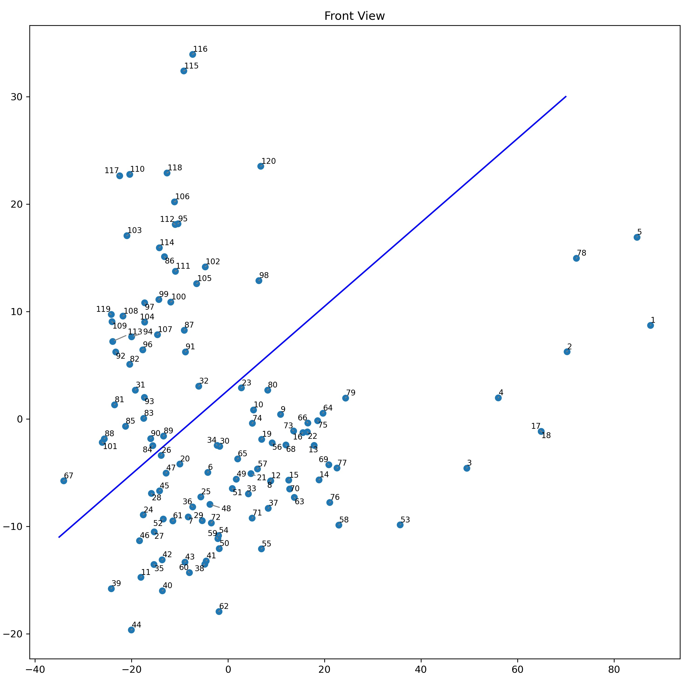
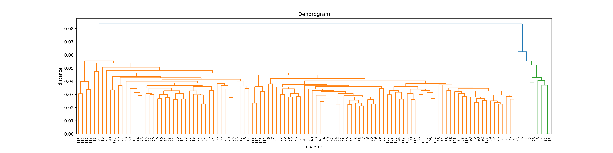



红楼遗梦——红楼梦作者有谁？胡适的前 80 后 40 之说是否正确？

为了获取高质量的文本，最后选择了直接爬取“红楼星语”网站。\
我以庚辰本（北大脂批本）作 1-80 回，81-120 回采用程乙本。（庚辰本 17/18 未分回，李文中对半拆开。）

*P1 以 120 回每回作为观测数据，以 44 个虚词和句长为特征，对应变换后在主平面的投影*

*P2 以类卡方距离度量，类平均法递归的系统聚类图*

**可以看到两部分点有明显的分隔——前 80 回与后 40 回很可能出自截然不同的手笔。**

争议极大的 1-5 回（“曹第五次批阅说”）、17-18 回、53 回都得到了一定的支持。

细分来看前 80 与后 40 均非浑然一体，某些学者曾给出许多激进的论断：前 80 由佚名《石头记》经曹雪芹《风月宝鉴》插入；及三次增删的具体回目；后 40 并非胡适所说高鹗一人而由曹家据遗稿补写，程刊高校而成；均能得到映证。但此结果同时回避了脂砚斋、曹頫等说的疑问。

---

下载链接：

[红楼梦文本](./text.zip)（网站文本、电子书转换的较脏文本，包含庚辰本、程乙本、当代校注本、脂评汇校本）

[处理代码](./code.zip)（Python，包含爬虫、分析、变量数据）

---

相关文献：

**[1] 李贤平. (1987). 《红楼梦》成书新说. Fu Dan Xue Bao. She Hui Ke Xue Ban, (5), 3-16.**

[2] 施建军. (2010). 关于以《红楼梦》120回为样本进行其作者聚类分析的可信度问题研究. Hong Lou Meng Xue Kan, (5), 318-335.

[3] 潘旭澜. (1987). 序《成书新说》. Fu Dan Xue Bao. She Hui Ke Xue Ban, (5), 17-18.

[4] 碧峰. (1988). 《〈红楼梦〉成书新探》讨论会简述. Fu Dan Xue Bao. She Hui Ke Xue Ban, (1), 111-112.
