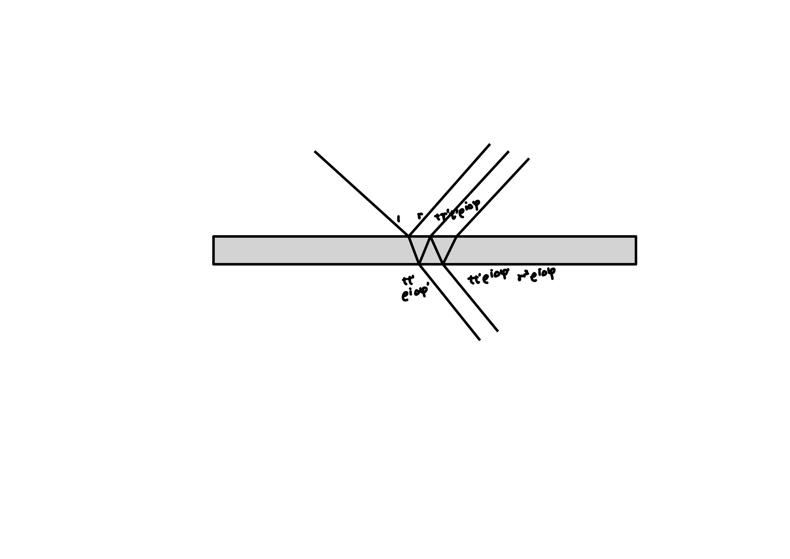
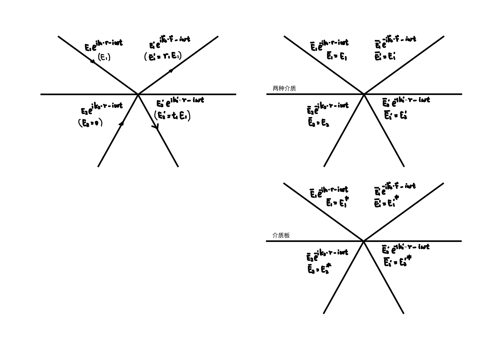


假设某界面上下有四束平面电磁波，介质 1 中入射与出射电磁波为 $\vec{E}\_{1}, \vec{E}\_{1}^{\prime}$，介质 2 中入射与出射电磁波为 $\vec{E}\_{2}, \vec{E}\_{2}^{\prime}$。

$$
\begin{array}{l}
\vec{E}\_{1} = \mathrm{Re}{( \vec{E}\_{1} e^{ i \vec{k}\_{1} \cdot \vec{r} - i \omega t } )} \\\
\vec{E}\_{1}^{\prime} = \mathrm{Re}{( \vec{E}\_{1}^{\prime} e^{ i \vec{k}\_{1}^{\prime} \cdot \vec{r} - i \omega t } )} \\\
\vec{E}\_{2} = \mathrm{Re}{( \vec{E}\_{2} e^{ i \vec{k}\_{2} \cdot \vec{r} - i \omega t } )} \\\
\vec{E}\_{2}^{\prime} = \mathrm{Re}{( \vec{E}\_{2}^{\prime} e^{ i \vec{k}\_{2}^{\prime} \cdot \vec{r} - i \omega t } )}
\end{array}
$$

简单起见，以下忽略 $\mathrm{Re}$ 与 $\vec{E}$。当反向传播时采用 $\bar{E}$ 作为记号，当 $\bar{E}\_{i}^{\prime} = E\_{i}$ 时，$\bar{E}\_{i} = E\_{i}^{\prime}$。界面处的振幅反射率与振幅折射率定义为

$$
\begin{array}{l}
r\_{1} = \frac{E\_{1}^{\prime}}{E\_{1}} & E\_{2} = 0 \\\
t\_{1} = \frac{E\_{2}^{\prime}}{E\_{1}} & E\_{2} = 0 \\\
r\_{2} = \frac{E\_{2}^{\prime}}{E\_{2}} & E\_{1} = 0 \\\
t\_{2} = \frac{E\_{1}^{\prime}}{E\_{2}} & E\_{1} = 0
\end{array}
$$

如果界面上的反射与折射源于上下折射率的不同，相位偏移来源于 Maxwell 方程组，则满足

$$
\begin{array}{l}
r\_{1} + r\_{2} = 0 \\\
r\_{1}^{2} + t\_{1} t\_{2} = 1
\end{array}
$$

如果表示介质板的等效反射与折射系数，相位偏移源于介质板内部的光程差，则满足

$$
\begin{array}{l}
r\_{1} r\_{1}^{\*} + t\_{1}^{\*} t\_{2} = 1 \\\
r\_{1}^{\*} t\_{1} + r\_{2} t\_{1}^{\*} = 0
\end{array}
$$

### 介质交界面处的等效系数

以 s 光为例，Maxwell 方程组的边界条件为

$$
\begin{array}{l}
\varepsilon\_{r1} \cdot 0 = \varepsilon\_{r2} \cdot 0 \\\
E\_{1s} + E\_{1s}^{\prime} = E\_{2s} + E\_{2s}^{\prime} \\\
B\_{1s} \sin \theta\_{1} + B\_{1s}^{\prime} \sin \theta\_{1}^{\prime} = B\_{2s} \sin \theta\_{2} + B\_{2s}^{\prime} \sin \theta\_{2}^{\prime} \\\
B\_{1s} \cos \theta\_{1} - B\_{1s}^{\prime} \cos \theta\_{1}^{\prime} = B\_{2s} \cos \theta\_{2} + B\_{2s}^{\prime} \cos \theta\_{2}^{\prime} \\\
k\_{1} E\_{1} = \omega B\_{1} \quad k\_{1} E\_{1}^{\prime} = \omega B\_{1}^{\prime} \quad k\_{1} = \sqrt{\varepsilon\_{r1}} \frac{\omega}{c} \\\
k\_{2} E\_{2} = \omega B\_{2} \quad k\_{2} E\_{2}^{\prime} = \omega B\_{2}^{\prime} \quad k\_{2} = \sqrt{\varepsilon\_{r2}} \frac{\omega}{c}
\end{array}
$$

则考虑 $t = 0$ 时刻空间中的电磁波，令所有的 $k$ 反向，所有的 $B$ 反向，则所有的 $E$ 不变，上述方程依旧成立。注意上两张图中的 $E\_{1}$ 未必相等，而是由 Maxwell 方程组保证可能出现相等的情况。介质表面只有两个自由度（只有两束光是能任意选择大小的）。

### 介质板的等效系数

介质板的相位偏移来源于内部光程，以介质薄膜为例，$E\_{2} = 0$时

$$
\begin{array}{l}
E\_{1}^{\prime} = E\_{1} ( r + t r^{\prime} t^{\prime} e^{i \Delta \varphi} ( \sum\_{j = 0}^{\infty} [ r^{\prime 2} e^{i \Delta \varphi}]^{j} ) ) \\\
E\_{2}^{\prime} = E\_{1} ( t t^{\prime} e^{i \Delta \varphi^{\prime}} \sum\_{j = 0}^{\infty} [ r^{\prime 2} e^{i \Delta \varphi}]^{j} ) \\\
\end{array}
$$

则考虑 $t = 0$ 时刻空间中的电磁波，令所有的 $k$ 反向，所有的 $B$ 反向，则所有的 $E$ 不变。由于光线反向传播所有的 $\Delta \varphi$ 反号，$r, t, r^{\prime}, t^{\prime}$ 为实数，因此新的 $\bar{E}\_{1}, \bar{E}\_{1}^{\prime}, \bar{E}\_{2}, \bar{E}\_{2}^{\prime}$ 满足原本 $E\_{1}^{\*}, E\_{1}^{\prime \*}, E\_{2}^{\*}, E\_{2}^{\prime \*}$ 间的关系。

### 构造

假设初始只有 $E\_{1} = 1$ 入射，产生了 $E\_{1}^{\prime} = r\_{1}, E\_{2}^{\prime} = t\_{1}$。

**对于两介质分界面**，

1. 构造 $\bar{E}\_{1}^{\prime} = r\_{1}$，产生 $\bar{E}\_{1} = r\_{1}^{2}, \bar{E}\_{2} = r\_{1} t\_{1}$。将光线反向，振幅不变。
2. 再构造 $E\_{2}^{\prime} = t\_{1}$，类似有 $E\_{1} = t\_{1} t\_{2}, E\_{2} = t\_{1} r\_{2}$。这两种情况叠加即为初始情况。

$$
\begin{array}{l}
r\_{1}^{2} + t\_{1} t\_{2} = 1 \\\
r\_{1} t\_{1} + t\_{1} r\_{2} = 0
\end{array}
$$

**对于介质板的等效系数**

1. 构造 $\bar{E}\_{1}^{\prime} = r\_{1}^{\*}$，则出射光为 $\bar{E}\_{1} = r\_{1}^{\*} r\_{1}, \bar{E}\_{2} = r\_{1}^{\*} t\_{1}$。反向后为 $E\_{1}^{\prime} = r\_{1}, E\_{1} = r\_{1} r\_{1}^{\*}, E\_{2} = r\_{1} t\_{1}^{\*}$。
2. 类似构造 $E\_{2}^{\prime} = t\_{1}, E\_{1} = t\_{1} t\_{2}^{\*}, E\_{2} = t\_{1} r\_{2}^{\*}$。

$$
\begin{array}{l}
r\_{1} r\_{1}^{\*} + t\_{1} t\_{2}^{\*} = 1 \\\
r\_{1} t\_{1}^{\*} + t\_{1} r\_{2}^{\*} = 0
\end{array}
$$

### 以下命题成立

反向的两束光线的电场矢量和磁场矢量无法同时相消。

对于介质交界面，如果允许存在 $E\_{1} e^{ i \vec{k}\_{1} \cdot \vec{r} - i \omega t }, E\_{1}^{\prime} e^{ i \vec{k}\_{1}^{\prime} \cdot \vec{r} - i \omega t }, E\_{2} e^{ i \vec{k}\_{2} \cdot \vec{r} - i \omega t }, E\_{2}^{\prime} e^{ i \vec{k}\_{2}^{\prime} \cdot \vec{r} - i \omega t }$，则允许存在 $E\_{1} e^{ - i \vec{k}\_{1} \cdot \vec{r} - i \omega t }, E\_{1}^{\prime} e^{ - i \vec{k}\_{1}^{\prime} \cdot \vec{r} - i \omega t }, E\_{2} e^{ - i \vec{k}\_{2} \cdot \vec{r} - i \omega t }, E\_{2}^{\prime} e^{ - i \vec{k}\_{2}^{\prime} \cdot \vec{r} - i \omega t }$。

对于介质板，如果允许存在 $E\_{1} e^{ i \vec{k}\_{1} \cdot \vec{r} - i \omega t }, E\_{1}^{\prime} e^{ i \vec{k}\_{1}^{\prime} \cdot \vec{r} - i \omega t }, E\_{2} e^{ i \vec{k}\_{2} \cdot \vec{r} - i \omega t }, E\_{2}^{\prime} e^{ i \vec{k}\_{2}^{\prime} \cdot \vec{r} - i \omega t }$，则允许存在 $E\_{1}^{\*} e^{ - i \vec{k}\_{1} \cdot \vec{r} - i \omega t }, E\_{1}^{\prime \*} e^{ - i \vec{k}\_{1}^{\prime} \cdot \vec{r} - i \omega t }, E\_{2}^{\*} e^{ - i \vec{k}\_{2} \cdot \vec{r} - i \omega t }, E\_{2}^{\prime \*} e^{ - i \vec{k}\_{2}^{\prime} \cdot \vec{r} - i \omega t }$。
