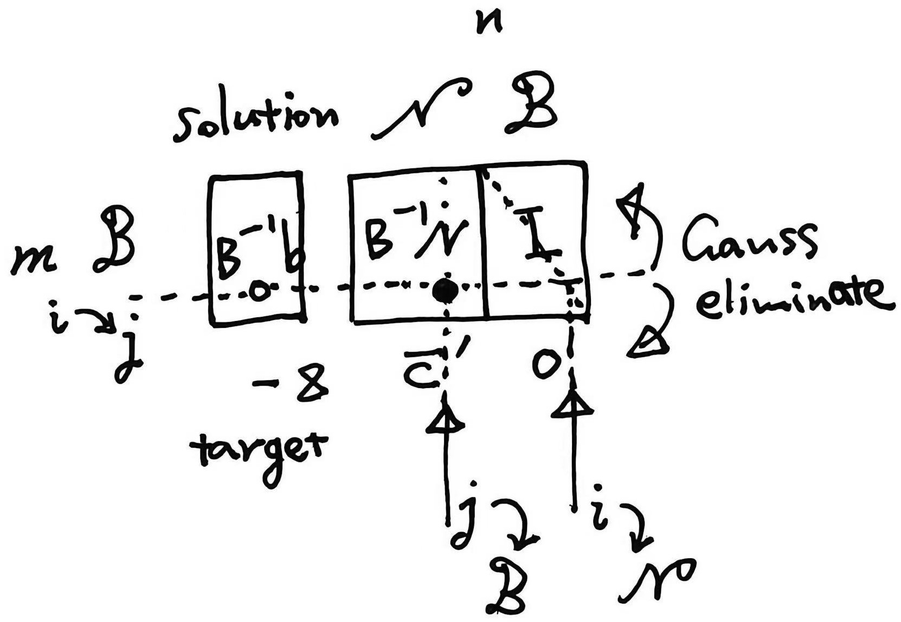



> 这里我来记录我认为的 20 世纪最具代表性的十个重要算法。鉴于已有包括 IEEE Computing in Science & Engineering 2000 及其之后的修改在内的许多更官方或大众的评选，并且其中一部分算法可能已经得到公认，因此我的版本自然也大差不差，但会稍微注重内容的不重叠性和数学性，主要目的还是帮助自己再对一些重要的算法做个回顾。

### 1 MC

$$
\int fp \leftrightarrow \mathbb{E}f \leftrightarrow \frac{1}{n}\sum\limits^n\_{i=1} f\_i \text{ sampling}
$$

Variance Control：$\mathbb{E}f(x) = \mathbb{E}(f(x)+c(g(x)-\mathbb{E}g(x)))$，$c^*=-\frac{\text{Cov}(f,g)}{\text{V} (g)}$

Importance Sampling：$\mathbb{E}\_Xf(x)=\mathbb{E}\_Y\frac{f(y)p(y)}{q(y)}$，$q^*(y)=\frac{\vert f(y)\vert p(y)}{\mathbb{E}\_Xf(x)}$（not computable）

### 2 Simplex

$$
\begin{aligned}
\text{(LP)} & \min\limits\_{x\in \mathbb{R}^n} c^\prime x\\\
\text{s.t.} & Ax=b,\\\ & x\ge 0
\end{aligned}
$$

对于 $Ax\le b$ 条件可引入松弛变量 $Ax + s = b$（$b\ge 0$ 则 $s\in \mathbb{R}^m\_+$ 可作为初始 $x\_N$）。

线性目标函数在凸可行域上一定有顶点为最优解。这些顶点用基变量 $x\_B\in \mathbb{R}^m$ 记载（$A \in \mathbb{R}^{m\times n}$，$m<n$），即从 $x$ 下标集 $\\{1,\dots,n\\}$ 中选取 $m$ 个非零分量，剩余 $n-m$ 个分量为 $0$。$AP=[B, N],\ Px={x\_B \brack x\_N}$，$x\_B = B^{-1}b - B^{-1}Nx\_N$。

目标函数 $z=c\_B^\prime x\_B+c\_N^\prime x\_N = c\_B^\prime B^{-1}b+\bar{c}^\prime x\_N$，Reduced Cost $\bar{c}=c\_N-N^\prime B^{-1\prime}c\_B$。入基变量 by $\max\limits\_j \bar{c}\_j >0$（Dantzig Rule），沿这一较优方向行走到尽头（另一顶点）时某变量被出基，对应 $x\_{i\in B} \ge 0$ 取等。故入基变量值 $x\_j^* = \min\limits\_i \frac{(B^{-1}b)\_i}{(B^{-1}a\_j)\_i}$，$a\_j$ 为 $A$ 第 $j$ 列，此式即挑出出基变量 $i$。Pivot 更新 $x\_B$ 和 $B^{-1}$。

最优的充要条件为 $\forall j\in N,\ \bar{c}\_j\le 0$。当出现某个 $\bar{c}\_j>0$ 而 $B^{-1}a\_j\le 0$ 则原问题无界。

对于初始基选取，除了前述自然基（$B=I\_m$）情形，可引入人工变量 $u\_i\ge 0$ 于每条 $a^\prime x=b$ 或 $a^\prime x\ge b$ 或 $a^\prime x\le b,\ b<0$ 约束（分别变为 $a^\prime x+u=b,\ a^\prime x-s+u=b,\ -a^\prime x-s+u=-b$）。两阶段法 phase 1 将目标改为 $\min \sum\limits\_i u\_i$，其余 $x,s$ 置 $0$ 跑一遍得到解 $u^*=0$（否则原问题不可行），phase 2 删去人工变量并以此时的基出发。大M法直接修改原目标 $\min c^\prime x+M\sum\limits\_i u\_i$，$M\gg 1$（太小压不下去，但太大数值不稳定）。

Bland Rule：如果某个顶点退化 $\exists i\in B,\ x\_i = 0$，pivot 后目标值将不变（出入 $0$）。取 $\min j \text{ s.t. }\bar{c}\_j>0$ 入基，达到 $\min\limits\_i \frac{(B^{-1}b)\_i}{(B^{-1}a\_j)\_i}$ 的多个 $i$ 中最小的出基，可以避免循环（有限步停）。

Tableau：

Interior-Point Method：从可行域中间直接前往最优点而不是沿边走（Klee–Minty example 单纯形法需遍历全部顶点即指数复杂度）。

将负梯度 $-c$ 向 $A$ 的零空间投影得到搜索方向 $d\_k = -Pc = -(I-A^\prime (AA^\prime )A)^{-1}c$（由此立刻写出最优性条件 $d\_k = 0$ 和无界条件 $d\_k > 0$，note $c^\prime x\_{k+1}=c^\prime x\_k-\alpha\_k\|d\_k\|^2$ 即充分下降）。同时步长 $\alpha$ 的上限由 $x\_{k+1}\ge 0$ 控制，$\alpha\_k = \gamma \min\limits\_i\\{\frac{(x\_k)\_i}{-(d\_k)\_i}|(d\_k)\_i<0\\},\ \gamma\in(0,1)$，这里收缩一个因子是因为在靠近边界的地方搜索效率很低（或障碍 $\log x$ 爆炸），保持严格内点。

可以想到使用线性变换 $x=Xy$ 在每步中将迭代点映至较好的内部如 $e=(1,\dots,1)^\prime ,\ X=\text{diag}(x)$，再对 $y$ 移动，写为 $x$ 的式子则为 $d\_k = -(I-X\_kA^\prime (AX\_k^2A^\prime )AX\_k)^{-1}X\_kc,\ x\_{k+1}= x\_k + \alpha\_kX\_kd\_k$。算法终止条件为 feasible $d\_k\le 0$ 且 $-e^\prime d\_k\le \epsilon$ 足够小，即 $d\_k \approx 0$ 最优解。

初始点（影响性能）获取上类似于单纯形法，现代求解器有更成熟的方式。

从 Primal-Dual 内点法来推导，框架为凸优化 $\min\limits\_x f(x) \text{ s.t. } Ax=b,\ x\in \mathcal{K}$，构造障碍函数 $\phi(x)$ 如 LP 问题中为 $-\sum\limits\_i \log x\_i$，改为等式约束下最小化 $f+\mu \phi$，中心参数 $\mu$ 有 $x(\mu)\rightarrow x^*,\ \mu \downarrow 0$。这相当于将原问题 KKT 中的 complementary slackness 光滑化 $x\_is\_i=\mu$，即现 KKT 系统为（$w$ 为对偶问题解）
$$
\left\\{ \begin{aligned}
& Ax = b \\\
& A^\prime w + s = -\nabla f(x) = c \\\
& x\_i s\_i = \mu \\\
& x>0,\ s>0
\end{aligned}\right.
$$
采用 Newton 步 $\left[\begin{array}{ccc}0 & A & 0 \\\ A^T & 0 & I \\\ S & 0 & X\end{array}\right]\left[\begin{array}{l}\Delta w \\\ \Delta x \\\ \Delta s\end{array}\right]=\left[\begin{array}{c}0 \\\ 0 \\\ \mu e-X S e\end{array}\right]$ 并令 $\mu = 0$ 得到 $\Delta w=\left(A X^2 A^T\right)^{-1} A X^2 c$，$\Delta x=-\left[I-X A^T\left(A X^2 A^T\right)^{-1} A X\right] X c$ 同上面的搜索方向。且 $\mu = \frac{1}{n}e^\prime X\_k(c-A^\prime w\_k) = \frac{1}{n}e^\prime d\_k$，终止条件即 $\mu \le n\epsilon$。

### 3 Krylov

一类逐步扩张子空间从而用其中的近似解逼近最优解的方法，适应大型稀疏矩阵问题（矩阵-向量乘积多）。Krylov subspace $\mathcal{K}\_n(A,r\_0)\triangleq \text{span}\\{r\_0,Ar\_0,\dots,A^{n-1}r\_0\\}$。近似解可以残差最小化或残差正交化来寻找（对于 CG 两者同一）。

Conjugated Gradient：

除此之外对于 $Ax=b$ 问题，若为对称不定可用 MINRES，非对称可用 GMRES、QMR 等。$Ax=\lambda x$ 问题则可维护 Krylov 子空间中的一组正交基，在其上投影以构建一个小的相似矩阵 $VAV^\prime $ 并求出其特征值和向量（Ritz pair）作为近似。

Arnoldi：

### 4 FFT

### 5 QR

Schur 定理知 适应稠密矩阵的特征值和向量求解

### 6 Quick Sort

### 7 FMM

### 8 Kalman

### 9 Vertibi

作为动态规划的一个代表且广泛应用。

### 10 RSA

---

> 

### 11 LLL

### 12 Quasi Newton

### 13 Annealing

### 14 SVD

Golub-Kahan

### 15 JPEG

### 16 De Bruijn

### 17 PageRank

### 18 Dijkstra

### 19 Hash

### 20 BP

