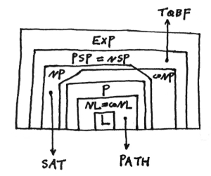



## 1 Automaton and Language

#### 1.1

computation model, finite automation, **FDA**

**transition function** $\delta:Q\times \Sigma\rightarrow Q$, accept state, languge $L(M)=A$

**regular language**, **regular operation**: union $\cup$, concatenation $\circ$, star $^*$

nondeterministic $\epsilon$ **NFA** $\delta:Q\times \Sigma_\epsilon \rightarrow \mathcal{P}(Q)$

$NFA=DFA$

$REG$ is closure under regular operation

**regular expression** $REX$: $R = a\in \Sigma \text{ or } \epsilon \text{ or } \varnothing \text{ or } R_1\cup R_2  \text{ or } R_1\circ R_2  \text{ or } R_1^*$​

token, lexical analyzer

**GNFA** (like contraction) $\delta:(Q-\\{q_{acc}\\})\times (Q-\\{q_{acc}\\}) \rightarrow \mathcal{R}$​

equivalence: a language is regular iff it can be expressed by regex. *proof: construction in closure; GNFA*

irregular lang. *example:* $A=\\{0^n1^n|n\geq 0\\}$

**Pumping Lem.**: $\text{lang.} A \in REG,\ \exist\ p,\ \forall \text{ string }s\text{ with a length of no less than }p, s=xyz \text{ and:}\\\ 1.\forall i\geq 0,\ xy^iz\in A\quad 2.|y|>0\quad 3.|xy|\leq p$

#### 1.2

parser, context-free grammar, **context-free language CFL**

**parse tree**, **leftmost derivation**\
**ambiguous**, **inherently ambig.** e.g. $a^nb^nc^nd^n \in L=\\{a^nb^nc^md^m|n,m\ge1\\}\cup \\{a^nb^mc^md^n|n,m\ge1\\}$

**Chomsky normal form**: $A\rightarrow BC$ or $A\rightarrow a$ (or $S\rightarrow \epsilon$​)

**pushdown automaton PDA**, stack, $\delta:Q\times \Sigma_\epsilon\times \Gamma_\epsilon \rightarrow \mathcal{P}(Q\times \Gamma_\epsilon)$

equivalence: a language is context-free iff it can be recognized by a PDA.\
*proof: sign symbol $\\$$, nondeter. substitution and comparison; $A_{pq}$ for string that brings PDA from state $p$ and empty stack to $q$ and empty stack $\rightarrow A_{pr}A_{rq}$ or $\rightarrow a A_{rs} b$​*

$REG \subset CFL$

**CFL's Pumping Lem.**: $\dots s=uvxyz \text{ and:}\\\ 1.\forall i\geq 0,\ uv^ixy^iz\in A\quad 2.|vy|>0\quad 3.|vxy|\leq p$

*more:* DPDA, DCFL; leftmost reduction, valid string, handle, forced handle, DCFG

*more:* dotted rule; DK-test; almost(end sign lang.) equivalence of DCFG and DPDA; **LR(k) grammar**

## 2  Computability

#### 2.1

**Turing machine**, **configuration**  $L(M)$

**Turing-recognizable**, **decidable**

variants and robustness: multitape TM, nondeterministic TM, enumerator\
**recursive enumerable**

**algorithm**, **Hilbert's problem**, **Church-Turing Thesis**

description of TM

#### 2.2

decidable problem(language): $A,\ E,\ EQ$ for $DFA(REX),\ CFG$ except $EQ_{CFG}$​

$REG \subset CFL \subset DECI \subset RE$​

**universal TM**, $A_{TM}$ is undecidable. *proof: contradiction, Cantor diagonal method*

The set of all TM $\\{\langle M\rangle \\}$ is countable but the set of all lang. $\mathcal{L}$ is uncountable, thus $\exist\ lang. A \notin RE$.

$A,\ \overline{A} \in RE \Rightarrow A \in DECI$   $\overline{A_{TM}} \notin RE$​

#### 2.3

**reduction**(\
undeci.: $HALT_{TM},\ E_{TM},\ REG_{TM},\ EQ_{TM}$ *proof: reduct to $A_{TM}$ etc.​*

**Rice Thm.**: $P \text{ is a non-trivial property},\ L_p = \\{\langle M\rangle | L(M) \in P\\} \text{ is undeci.}$ (not all TM descriptions belong to set $P$ and $L(M_1)=L(M_2),\ \langle M_2\rangle \in P \text{ iff } \langle M_1\rangle \in P$.)

computation history\
**LBA**  $A_{LBA}$ is deci. but $E_{LBA}$ is undeci.

*more:* $ALL_{CFG},\ PCP$

computable function, mapping(many-one) reducibility: $\exist\text{ computable func. } f:\Sigma^\*\rightarrow\Sigma^\*,\ \forall \omega,\ \omega\in A \Leftrightarrow f(\omega)\in B$  $A\leq_m B$​

If $A$ is undeci./unre. then $B$ is undeci./unre.; if $B$ is deci./re. then $A$ is deci./re.

$A\leq_m B \Leftrightarrow \overline{A} \leq_m \overline{B}$\
*example:* $A_{TM} \leq_m \overline{EQ_{TM}}$​

#### 2.4

$SELF$​ machine that obtains its own description

**Recursion Thm.**: $T \text{ is a TM of func. } t: \Sigma^\* \times \Sigma^\* \rightarrow \Sigma^\*,\ \exist\text{ TM }R\text{ of func. } r:\Sigma^\* \rightarrow \Sigma^\*,\ \forall \omega ,\ r(\omega) = t(\langle R\rangle, \omega)$

minimal description of TM $MIN_{TM}$\
fixed point $\exist F,\ f(\langle F\rangle) = F$​

mathematical logic: model, formula $\supset$ sentence $\supset$ theory

$Th(\mathbb{N},+)$ is deci. *proof: NDA recursion*  $Th(\mathbb{N},+,\times)$ is undeci.

**oracle TM**\
$T^{A_{TM}}$ is much stronger but there still be some lang. it can not deci.

A decidable relative to B, **Turing reducible** $A\leq_T B$\
*example:* $E_{TM} \leq_T A_{TM}$​

#### 2.5

minimal description of string $d(x)$, **descriptive(Kolmogorov) complexity** $K(x) =\min |\langle M,\omega \rangle|$ where $x$ is on the tape when $M$ halts on the input $\omega$ (or $K(x)=\min\limits_{p:\mathcal{U}(p)=x}l(p)$​)

$K(x)$ is uncomputable.\
**Godel incompleteness thm.**, Berry paradox

$K(xy) \leq K(x)+K(y)+O(\log K(x))$ but can not reach $K(x)+K(y)+O(1)$.

$\forall \text{ desc. lang. } A ,\ \exist c_A,\ \forall x,\ K(x)\leq K_A(x)+c_A$​

$|\\{x\in \\{0,1\\}^\*:K(x)<k\\}|<2^k$  for integer $n$, $K(n)\le \log^\*n+c$

$\forall \mathcal{U},\ \sum\limits_{p:\mathcal{U}(p)\text{halts}} 2^{-l(p)}\le 1$ (by Kraft ineq.)  $sto. \\{X^n\\} \overset{iid.}{\sim} f(x),\ \frac{1}{n} EK(X^n|n)\rightarrow H(X)$ (by source coding thm.)

*more:* c-compressible\
There always exists incompressible string of any length.($\lim\limits_{n\rightarrow \infty}\frac{K(x^n|n)}{n}=1$) There exists a constant $b$ for $\forall x, d(x)$ is incompressible by $b$​.

**universal/Solomonoff prob.** $P_{\mathcal{U}}(x)=\sum\limits_{p:\mathcal{U}(p)=x} 2^{-l(p)}$  $\forall \text{ computer } A ,\ \exist c_A,\ \forall x,\ P_{\mathcal{U}}(x)\ge c_A P_{A}(x)$​

equivalence: $\exist c,\ \forall x,\ |\log\frac{1}{P_{\mathcal{U}}(x)}-K(x)|\le c$

**Chaitin** $\Omega=\sum\limits_{p:\mathcal{U}(p)\text{halts}} 2^{-l(p)}$

*more:* Kolmogorov structure function, Kol. minimal sufficient statistics

## 3  Complexity

#### 3.1

big O notation, small O notation

Unlike compuability, complexity depends on the computing model.

**time complexity** $TIME(f(n))$\
*note:* $TIME(O(n\log n)) \subset REG$

$P=\bigcup\limits_k TIME(n^k)$\
**PATH**, REL_PRIME, CFL

verifier, certificate\
$NP=\bigcup\limits_k NTIME(n^k)=P\_VERI \subset EXPTIME$\
HAM_PATH, COMPOSITES, CLIQUE

$P\overset{?}{=}NP$, **NP-complete**, **SAT**

**polynomial time computable function**, **polynomial time reduction** $A\leq_PB$

*more:* cnf formula, 3SAT(is NPc)

**Cook-Levin Thm.**: SAT is NPc. *proof: tableau, window $\phi_{cell}\wedge\phi_{start}\wedge\phi_{move}\wedge\phi_{accept}$​*

#### 3.2

**space complexity** $SPACE(f(n))$​

$SPACE(f(n))\subset TIME(2^{O(f(n))})\subset SPACE(2^{O(f(n))})$

**Savitch Thm.**: $\forall f: \mathbb{N}\rightarrow\mathbb{R}^+,\ \text{where}\ f(n)\geq n(\text{acc.}\ \log n),\ NSPACE(f(n))\subseteq SPACE(f^2(n))$

$PSPACE=NPSPACE \supseteq NP$

**PSPACE-complete**, **PSAPCE-hard**\
TQBF, FORMULA_GAME

**bitape TM**, $L=SPACE(\log n)\overset{?}{=}NL$

**log space transducer**, **log space reduction** $A\leq_LB$

PATH is NLc, $NL=coNL\subseteq P$

#### 3.3

**space constructible**($f(n)\geq O(\log n)$), **time constructible**($f(n)\geq O(n\log n)$)

**Hierarchy Thm.**: $\forall\ \text{constructible}\ f: \mathbb{N}\rightarrow\mathbb{N},\ \exist\ \text{lang.}\ A,\\ \text{decidable in space } O(f(n))\text{ but not } o(f(n));\ \text{in time } O(f(n))\text{ but not } o(f(n)/\log n)$

$NL \subsetneq PSPACE$, $PSAPCE \subsetneq EXPSPACE$, $P\subsetneq EXPTIME$

*more:* EXPSPACE-complete; circuit complexity

*advanced topics:* approx. algorithm, probabilistic TM (BPP), prime, alternating TM, IP=PSPACE, parallel RAM (NC), cryptography(private-key cryptosystem, pulic-key cryptosystem RSA)

*family picture:*

