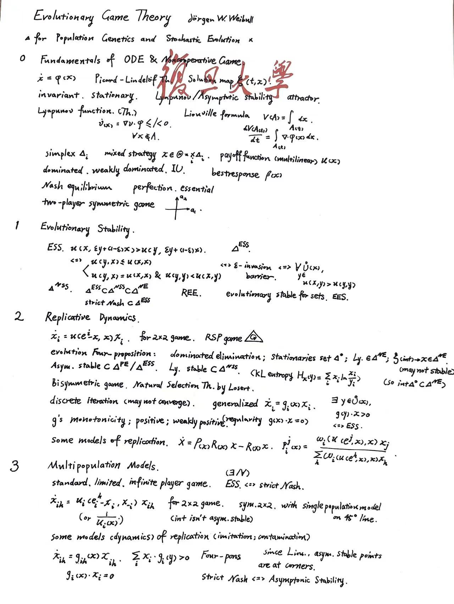



传统博弈论自 Von Neumann 的最小最大博弈和 Nash 的均衡概念（并使用 Brower/Kakutani fix point 证明了存在性）而兴起，扩展到基于 Bayes 和数学期望的非完全信息情形，后主要以泛函分析等为理论工具，并广泛应用于建模各类问题；不过几乎始终囿于精巧的函数分析，均衡解的存在、可达与稳定性等，对于智能体决策的刻画较为有限，且缺乏复杂的动态性（即便演化博弈论），但这一方法论仍存有其可取之处和简洁的洞察力，对框架应予以基本的了解。

下面的讲义为本人重新基于 belief 概念整理后的形式化理论，并借鉴拓扑的思路分析不同博弈中的不变性。

---

### 讲义

  <iframe src="./notes.pdf"
          width="100%"
          height="800"
          style="border:1px solid #e5e7eb; border-radius:8px;"
          allowfullscreen>
    你的浏览器不支持内嵌 PDF，点击 <a href="./notes.pdf">这里下载</a>。
  </iframe>

### 演化博弈论大纲

