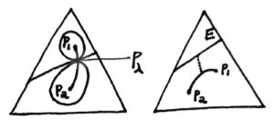
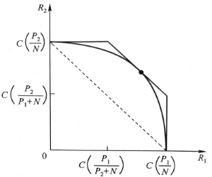


## 1 Entropy

#### 1.1

**entropy** $H(X) = - \sum\limits\_{x\in \mathcal{X}} p(x)logp(x) = -Elogp(X)$

**joint entropy**, **conditional entropy**  $H(X,Y)=H(X)+H(Y|X)$\
*note:* usually $H(X|Y) \neq H(X|Y=y)$

**relative entropy(KL distance)** $D(p\\|q)=- \sum\limits\_{x\in \mathcal{X}} p(x)log\frac{p(x)}{q(x)} = -Elog\frac{p(X)}{q(X)}$\
*note:* usually $D(p\\|q) \neq D(q\\|p)$

**mutual inforamtion** $I(X;Y)=D(p(x,y)\\|p(x)p(y))$

$I(X;Y)=H(X)+H(Y)-H(X,Y)=H(X)-H(X|Y),\ I(X;X)=H(X)$\
Venn diagram

**chain rule** $H(X\_1,\cdots,X\_n)=\sum\limits\_{i=1}^nH(X\_i|X\_{i-1},\cdots,X\_1),\ I(X\_1,\cdots,X\_n;Y)=\sum\limits\_{i=1}^nI(X\_i;Y|X\_{i-1},\cdots,X\_1)$

**Jesen Ineq**: $\text{convex func. }f\text{ and a RV }X,\ Ef(X)\geq f(EX)$

**Info. Ineq**: $D(p\\|q)\geq 0,\text{ eq. iff }p=q$  $I(X;Y)\geq 0, \text{ eq. iff }X\ id.\ Y$

$H(X)\leq log|\mathcal{X}|$  $H(X\_1,\cdots,X\_n)\leq \sum\limits\_{i=1}^nH(X\_i)$

**log-sum Ineq**: $\sum\_{i=1}^n a\_i \log \frac{a\_i}{b\_i} \geq\left(\sum\_{i=1}^n a\_i\right) \log \frac{\sum\_{i=1}^n a\_i}{\sum\_{i=1}^n b\_i}$  $D(p\\|q)$ is convex about $(p,q)$ and $H(p)$ is concave about $p$.

Markov chain $X\rightarrow Y\rightarrow Z,\ I(X;Z|Y)=0$\
**Data Processing Ineq**: $I(X;Y)\geq I(X;Z),\text{ eq. iff }I(X;Y|Z)=0$

$\theta \rightarrow X \rightarrow T(X)$ **sufficient statistics** $I(\theta ;X)=I(\theta ;T(X))$ or $X\ id.\ \theta\text{ when }T(X)\text{ is given}$\
**minimal suf. stat.** $\theta \rightarrow T(X) \rightarrow U(X) \rightarrow X$

**Fano Ineq**: $X\rightarrow Y \rightarrow \hat{X},\ P\_e=Pr(X\neq \hat{X}),\ H\_e = -P\_elogP\_e -(1-P\_e)log(1-P\_e),\\\ H(X|Y)\leq H(X|\hat{X})\leq H\_e + P\_eH(X)\leq  H\_e + P\_elog|\mathcal{X}|$

$X \sim p(x),\ Y \sim q(y),\ Pr(X=Y)\geq 2^{-H(p)-D(p\\|q)}$​

#### 1.2

(weak)LLN, **asymptotic equipartition property AEP**: $X\_1,\cdots,X\_n \overset{iid.}{\sim}p(x),\ -\frac{1}{n}logp(X\_1,\cdots,X\_n) \overset{p}{\rightarrow} H(X)$

**typical set** $A^n\_\epsilon \subset \mathcal{X}^n$  $\text{large }n,\ Pr(A^n\_\epsilon) > 1-\epsilon,\ (1-\epsilon)2^{n(H(X)-\epsilon)} \leq |A^n\_\epsilon| \leq 2^{n(H(X)+\epsilon)}$ (In short, $A^n\_\epsilon$ has roughly $2^{nH}$ elements with equal prob. $2^{-nH}$.)

Nearly $nH$ bits can express sequence $X^n$.(typical set $n(H+\epsilon)+1$ bit and nontypical $nlog|\mathcal{X}|+1$ bit)

In the sense of first-order exponent, among all sets that have $Pr>1-\epsilon$，$A^n\_\epsilon$​ is the minimal.

stationary stochastic process, stationary Markov chain

**entropy rate** of a sto. $\\{X\_i\\}$: $H(\mathcal{X}) = \lim\limits\_{n\rightarrow \infty}\frac{1}{n}H(X\_1,\cdots,X\_n)$(if limit exists)

for stn. sto. $\text{also } = \lim\limits\_{n\rightarrow \infty}H(X\_n|X\_{n-1},\cdots,X\_1)$ *proof: Stolz-Cesaro Means Thm.*

for stn. MC of trans. mt $P$ and stn. dis. $\mu = P\mu$, $H(\mathcal{X}) = H(X\_2|X\_1) = -\sum\limits\_{ij}\mu\_iP\_{ij}logP\_{ij}$

**Second law of thermodynamics**: as time $n\uparrow$,
$$
D(\mu\_n\\\|\mu^\prime\_n)\downarrow,\text{ esp. }D(\mu\_n\\\|\mu);\\\ \text{if stn. dis. is uni.(equal a priori prob. principle) } H(X\_n)\uparrow;\\\ \text{for stn. MC }H(X\_n|X\_1)\uparrow;\\\ \text{operator(e.g. shuffling) }T\ id.\ X,\ H(TX)\geq H(X)
$$

$\text{stn. MC }\\{X\_n\\},\ Y\_i = \phi(X\_i),\ H(\mathcal{Y})=\lim\limits\_{n\rightarrow \infty}H(Y\_n|Y\_{n-1},\cdots,Y\_1)=\lim\limits\_{n\rightarrow \infty}H(Y\_n|Y\_{n-1},\cdots,Y\_1,X\_1)$

**Shannon-McMillan-Breiman(general AEP) Thm.**: $H$ is the entropy rate of a finite ergodic sto. ${X\_n}$, $-\frac{1}{n}logp(X\_0,\cdots,X\_{n-1}) \overset{a.s.}{\rightarrow} H$​  *proof: Sandwich Thm.*

#### 1.3

**differential entropy** $h(X)= -\int\_Sf(x)logf(x)dx$ ($S$ is the support set of RV $X$​)

joint diff. ent., conditional diff. ent., relative ent., MI, AEP are in the same way.

*example:* $h(\mathcal{N}(\mu,\Sigma))=\frac{n}{2}+\frac{1}{2}log(2\pi)^n|\Sigma|$; for bivar. $\mathcal{N}\_2$, $I(X\_1;X\_2)=-\frac{1}{2}log(1-\rho^2)$​

$h(aX)=h(X)+log|a|,\ h(AX)=h(X)+log|detA|$

Among all dis. with $\Sigma=EXX^\prime$, Gauss dis. has max ent. $h(X)\le \frac{1}{2}log(2\pi e)^n|\Sigma|$ *proof: $D(f\\|N)\geq 0,\ \int flogN = \int NlogN$*

estimation error (if have side info. $Y$) $E(X-\hat{X})^2\geq \frac{1}{2\pi e}e^{2h(X|Y)}$

Similarly, $A^n\_\epsilon = \\{x\in S^n:-\frac{1}{n}logp(x)-h(X)|\leq \epsilon\\}$. While in discrete case we use cardinal $|A^n\_\epsilon| \overset{\cdot}{=} 2^{nH}$, in continuous case we use volume $V(A^n\_\epsilon)\overset{\cdot}{=} 2^{nh}$ (like a cube with side length $2^h$).

relation with discrete ent: dis. $p(x)$ is Riemann integrable, $X$ is partitioned as $X^\Delta$ by intervals with length $\Delta$, then $\lim\limits\_{\Delta \rightarrow 0} H(X^\Delta)+log\Delta = h(X)$. Thus a $n$ bit quantized cont. RV $X$ has a ent. of $h(X)+n$.

*more:* several ineq. about det can be derived thru ent. of a multivar ndis. *e.g.* Hadamard ineq: $\prod\limits\_i \Sigma\_{ii} \geq |\Sigma|\geq \prod\limits\_i \sigma^2\_i$ where $\sigma^2\_i$ is the cond. variance of $X\_i$ given other $X\_j$, or $\sigma^2\_n = \frac{|\Sigma\_n|}{|\Sigma\_{n-1}|}$

#### 1.4

**Maximun entropy dis./princ./estimation**\
$\max\limits\_f h(f)\text{ s.t. }f(x)\geq 0,\ \int\_Sf(x)dx = 1,\ \int\_S f(x)r\_i(x)dx = \alpha\_i$

$f^\*(x)=e^{\lambda\_0+\sum\limits\_i \lambda\_i r\_i(x)}=\frac{e^{\sum\limits\_i\lambda r\_i(x)}}{\int\_S e^{\sum\limits\_i\lambda r\_i(x)}dx}$ *proof: Lagrange; Info ineq.*

*example:* Boltzmann dis. $S=[0,+\infty),\ EX=\mu,\ f(x)=\frac{1}{\mu}e^{-\frac{x}{\mu}}$

$S=(-\infty,+\infty),\ EX=\alpha\_1,\ EX^2=\alpha\_2,\ f(x)=\mathcal{N}(\alpha\_1,\alpha\_2-\alpha\_1^2)$ but when we have third moment constraint, $\lambda\_3$ needs to be $0$ to aviod $\int^{+\infty}\_{-\infty}f=\infty$, and therefore this method may be out of work. However we can add some carefully devised perturbation onto the original $\mathcal{N}$ to get whatever $\alpha\_3$ while holding $\alpha\_1$ and $\alpha\_2$. Thus $\sup h(f)=h(\mathcal{N}(\alpha\_1,\alpha\_2-\alpha\_1^2))=\frac{1}{2}\ln2\pi e(\alpha\_2-\alpha\_1^2)$, the max ent. is only $\epsilon$-reachable.

**diff. ent. rate** $h(\mathcal{X})=\lim\limits\_{n\rightarrow \infty}\frac{1}{n}h(X\_1,\cdots,X\_n) \overset{stn.}{=} \lim\limits\_{n\rightarrow \infty} h(X\_n|X^{n-1})$

for Gauss stno. $h(\mathcal{X})=\frac{1}{2}log2\pi e+\frac{1}{4\pi}\int^\pi\_{-\pi}logS(\lambda)d\lambda$, $\sigma^2\_\infty = \frac{1}{2\pi e}2^{2h}$(best em. error given inf. history)

AR model, **autocorrelation func.** $R(k)=EX\_iX\_{i+k}$  **power spectral density PSD** $S(\lambda) = \mathcal{F}(R(k))$

**Burg Thm.**:
$$
p\text{ order Gaussian-Markov autoreg. sto.}\\\ X\_i=\sum\_{j=1}^p a\_j X\_{i-j}+Z\_i,\ Z\_i\overset{iid.}{\sim}\mathcal{N}(0,\sigma^2)\\\ \text{attains the max ent. rate among all sto. satisfying the conditions}\\\ E X\_i X\_{i+k}=\alpha\_k, 1 \leq k \leq p,\forall i
$$

$a\_i,\sigma^2$ can be solved from Yule-Walker equations: $R(m)=\sum\limits\_{k=1}^p a\_k R(m-k)+\sigma^2 \delta\_{m, 0},1 \leq m \leq p$​

## 2  Coding, Statistics and Investment

#### 2.1

source coding $C: \mathcal{X}\rightarrow \mathcal{D}^\*,\ l(x)=|C(x)|,\ L(C)=El(X)$ (alphabet $\mathcal{D}=\\{1,\dots,D-1\\}$)

**nonsigular $\supset$ uniquely decodable $\supset$ instantaneous/prefix**

**Kraft ineq**: for inst. code on D, codeword length $l\_1,\dots$, $\sum\limits\_i D^{-l\_i}\leq 1$ *proof: all codewords' son sets disjoint.*

optimal code  $H\_D(X)\le L< H\_D(X)+1,\text{ eq. iff. }D^{-l\_i}=p\_i$ D-adic dis. *proof: Shannon coding by Lagrange*

**Shannon coding**: $l\_i=\lceil log\_D \frac{1}{p\_i}\rceil$ (to prove the upper bound)

for stno. $\\{X\_n\\}$, $L\rightarrow H(\mathcal{X})$\
**Shannon First Thm. (Noiseless Coding Thm.)**: $H(\mathcal{X})\le L\le H(\mathcal{X})+\frac{1}{n}$

for wrong code(using $q(x)$), the length will increase by $D(p\\|q)$

*note*: actually all uni. decodable codes satisfy Kraft ineq.(McMillian ineq.) so they are no better than prefix codes.

**Huffman coding** $C\_{H}$​ is optimal.

**Shannon-Fano-Elias coding** length $\lceil log\_D \frac{1}{p\_i}\rceil+1$(Elias) with codewords assigned by binary expansion of each symbol's prob. midpoint (not Fano's sorting).

Shannon coding is competitive optimal $Pr(l(X)\ge l^\prime(X)+c)\le \frac{1}{2^{c-1}}$​

(refer to *5.5* for Kolmogorov complexity)

**2.2**

prob. simplex $\mathcal{P}$  type $P\_x$ on $\mathcal{X}$, type class $T(P)=\\{x\in \mathcal{X}^n:P\_x=P\\},\ P\in \mathcal{P}^n$

$1.\ |\mathcal{P}^n|\le (n+1)^{|\mathcal{X}^|}\\\ 2.\ Q^n(x)=2^{-n(D(P\_x\\|Q)+H(P\_x))}\\\ 3.\ |T(P)|\overset{\cdot}{=} 2^{nH(P)}\\\ 4.\ Q^n(T(P))\overset{\cdot}{=} 2^{-nD(P\\|Q)}$

($x=\\{x\_1,\dots,x\_n\\},\ X\_i \overset{iid.}{\sim}Q(x)$​)

**seq. typical set** $T\_\epsilon^{Q^n}=\\{x:D(P\_x\\|Q)\le \epsilon\\},\ Pr(T\_\epsilon^{Q^n})\rightarrow 1,\ D(P\_x\\|Q)\overset{a.s.}{\rightarrow}0$​

Large deviation theory, **Sanov Thm.**:
$$
\text{subset }E\subset \mathcal{P},\ Q^n(E)\le (n+1)^{|\mathcal{X}|}2^{-nD^\*},\ D^\*=\min\limits\_{P\in E}D(P\\|Q);\\\ \text{if }E\text{ is the closure of its interior, }-\frac{1}{n}logQ^n(E) \rightarrow  D^\*
$$

if constraints $E=\\{P:\sum\limits\_xP(x)g\_i(x)\ge \alpha\_i\\}$, we can get $P^\*(x)=\frac{Q(x)e^{\sum\limits\_i\lambda g\_i(x)}}{\sum\limits\_{x\in \mathcal{X}}Q(x)e^{\sum\limits\_i\lambda g\_i(x)}}$​ using Lagrange.​

**jointly typical set** $A^n\_\epsilon = \\{(x^n,y^n)\in \mathcal{X}^n\times \mathcal{Y}^n: \left|-\frac{1}{n} \log p\left(x^n\right)-H(X)\right|<\epsilon,\ \left|-\frac{1}{n} \log p\left(y^n\right)-H(Y)\right|<\epsilon,\\\ \left|-\frac{1}{n} \log p\left(x^n, y^n\right)-H(X, Y)\right|<\epsilon\\},\ Pr(A^n\_\epsilon)\rightarrow 1$

$(\tilde{X}^n,\tilde{Y}^n)\sim p(x^n)p(y^n),\ Pr((\tilde{X}^n,\tilde{Y}^n)\in A^n\_\epsilon)\rightarrow2^{-nI(X;Y)}$ *proof: Sanov Thm.*

$\text{closed convex set }E \subset \mathcal{P},\ Q\notin E,\ P^\* = \arg\min\limits\_{P\in E}D(P\\|Q),\ \forall P\in E,\ D(P\\|Q)\ge D(P\\|P^\*)+D(P^\*\\|Q)$

**Conditional Limit Thm.**: $\text{seq. }X^n\overset{iid.}{\sim}Q,\ n\rightarrow \infty,\ Pr(X\_i=x|P\_{X^n}\in E)\overset{p}{\rightarrow}P^\*(x)$ (i.e. type $P^\*$ represents the whole set)  *proof: $D(P\_1\\|P\_2)\ge \frac{1}{2\ln2}\\|P\_1-P\_2\\|^2\_1$, D's convergence implies $\mathcal{L\_1}$ norm's convergence. (Taylor: $D(P\_1\\|P\_2)= \frac{1}{2}\chi^2\_{P\_1,P\_2}+\ldots$)*

Hypo test $X\_i \overset{iid.}{\sim}Q(x),\ H\_1:Q=P\_1,\ H\_2:Q=P\_2$, **Neyman-Pearson Lem.**: likelihood ratio $T\ge 0$, acceptance region $A\_n(T)=\\{x^n:\frac{P\_1(x^n)}{P\_2(x^n)}>T\\},\ \alpha^\*=P^n\_1(A^c\_n(T)),\ \beta^\*=P^n\_2(A\_n(T)),\\\ \text{ other regions with }\alpha\le \alpha^\*\text{ must have }\beta\ge \beta^\*$

$\frac{P\_1(X^n)}{P\_2(X^n)}>T$ equals to $D(P\_{X^n}\\|P\_2)-D(P\_{X^n}\\|P\_1)>\frac{1}{n}logT$, under this constraint we minimize $D(P\\|P\_2)$(also $D(P\\|P\_1)$) using Lagrange and get $P\_\lambda = \frac{P^\lambda\_1(x)P^{1-\lambda}\_2(x)}{\sum\limits\_{x\in \mathcal{X}} P^\lambda\_1(x)P^{1-\lambda}\_2(x)}$ to estimate $\alpha\_n \overset{\cdot}{=}2^{-nD(P\_\lambda\\|P\_1)}$, $\beta\_n \overset{\cdot}{=}2^{-nD(P\_\lambda\\|P\_2)}$. ($\lambda$ can be determined by $D(P\_{X^n}\\|P\_2)-D(P\_{X^n\\|P\_1})=\frac{1}{n}logT$​​.)

**relative ent. AEP**: $X\_1,\cdots,X\_n \overset{iid.}{\sim}P\_1(x),\ \forall P\_2(x),\ -\frac{1}{n}log\frac{P\_1(X\_1,\cdots,X\_n)}{P\_2(X\_1,\cdots,X\_n)} \overset{p}{\rightarrow} D(P\_1\\|P\_2)$

**relative ent. typical set** $P\_1(A^n\_\epsilon(P\_1\\|P\_2))>1-\epsilon,\ P\_2(A^n\_\epsilon(P\_1\\|P\_2))\rightarrow 2^{-nD(P\_1\\|P\_2)}$

**Chernoff-Stein Lem.**: $\alpha\_n=P^n\_1(A^c\_n),\ \beta\_n=P^n\_2(A\_n),\ \beta^\epsilon\_n =\min\limits\_{A\_n\subset \mathcal{X},\alpha\_n<\epsilon}\beta\_n,\ \lim\limits\_{n\rightarrow \infty}\frac{1}{n}log\beta^\epsilon\_n=-D(P\_1\\|P\_2)$

when Bayesian weighted $D^\*=\min\limits\_{A\_n} \lim\limits\_{n\rightarrow \infty}-\frac{1}{n}log(\pi\_1\alpha\_n+\pi\_2\beta\_n)$, **Chernoff Info.** $C(P\_1,P\_2)=D^\*=D(P\_\lambda\\|P\_1)=D(P\_\lambda\\|P\_2)$ or $C(P\_1,P\_2)=-\min\limits\_{0\le\lambda\le 1} log(\sum\limits\_xP^\lambda\_1(x)P^{1-\lambda}\_2(x))$

(*note:* $D^\*$ is not related to $\pi\_1,\pi\_2$ since large sample will eliminate a priori knowledge $\frac{\pi\_1}{\pi\_2}\frac{P\_1(X\_n)}{P\_2(X\_n)}\overset{?}{\sim}T$​)

Score func. $V=\frac{\partial}{\partial\theta}\ln f(X;\theta),\ EV=0$\
**Fisher Info.** $J(\theta)=EV^2=-E\frac{\partial^2}{\partial\theta^2}\ln f(X;\theta)$  $J\_n(\theta)=nJ(\theta)$

**Cramer-Rao Ineq**: $\text{unbiased stat. }T(X)\text{ of }\theta,\ \Sigma(T)\ge J^{-1}(\theta)$ (for multivar. it means mt $\Sigma-J^{-1}$​ is semipositive.) (Similarly, for biased stat. we have $b\_T(\theta)=ET-\theta,\ E(T-\theta)^2\ge \frac{(1+b^\prime\_T(\theta))^2}{J(\theta)}+b^2\_T(\theta)$.)

*proof: Cauchy-Schwarz Ineq. for $V-EV$ and $T-ET$.*

some senses:
for para. dis. family $\\{p\_\theta(x)\\}$, $\theta\rightarrow \theta^\prime,\ D(p\_\theta\\|p\_\theta^\prime)\sim \frac{J(\theta)}{2}$;\
**de Brujin Ineq** $Z\ id.\ X,\ Z\sim \mathcal{N}(0,1),\ \frac{\partial}{\partial t}h(X+\sqrt{t}Z)=\frac{1}{2}J(X+\sqrt{t}Z),\text{ if limit exists, }\frac{\partial}{\partial t}h(X+\sqrt{t}Z)\big|\_{t=0}=\frac{1}{2}J(X)$ ($h$'s base is $e$);\
Just like ent. power $2^{nH(X)}$ can be seemed as the volume of typical set, Fisher info. $J(X)$ can be seemed as the surface area, where $J(X)=\int \frac{(\frac{\partial f}{\partial x})^2}{f}dx$;\
**Fisher info's convolution ineq** $\frac{1}{J(X+Y)}\ge \frac{1}{J(X)}+\frac{1}{J(Y)}$

**ent. power Ineq**: $X\ id.\ Y,\ \dim X=\dim Y=n,\ 2^{\frac{2}{n}h(X+Y)}\ge 2^{\frac{2}{n}h(X)}+2^{\frac{2}{n}h(Y)}$ or $h(X+Y)\ge h(X^\prime+Y^\prime)$, where $X^\prime,Y^\prime\sim \mathcal{N},\ X^\prime\ id.\ Y^\prime,\ h(X^\prime)=h(X),\ h(Y^\prime)=h(Y)$

**2.3**

**Kelly game**  $b^\*=p$\
**Gambling conservation Thm.**: $W^\*+H=logm$​ (for uniform fair oppo. game)

estimation of entropy of English (Shannon letter guessing game)

potfolio $\mathcal{B}=\\{b\in \mathcal{R}^m:b\_i\ge 0, \sum\limits\_{i=1}^m b\_i =1\\}$ $X\sim F(x),\ S=b^\prime X$

first and second moment method: Sharpe-Markowitz theory, CAPM

growth rate $W(b,F)=\int logS dF = Elogb^\prime X$  $S\_n = \prod\limits\_{i=1}^n S\_i,\ \frac{1}{n}logS\_n \overset{a.s.}{\rightarrow}W,\ S\_n\overset{\cdot}{=} 2^{nW}$

log optimal porfolio $W^\*(F)=\max\limits\_b W(b,F)$

$W(b,F)$ is concave about $b$, linear about $F$, and $W^\*(F)$ is convex about $F$​.

$b^\*$'s KT condition: $E(\frac{b^\prime X}{{b^{*}}^\prime X})\le 1,\ E(\frac{X\_i}{{b^\*}^\prime X})=1\text{ if }b^\*\_i>0,\le 1\text{ if }b^\*\_i=0$

causal portfolio $b\_i:\mathcal{R}\_+^{m(i-1)}\rightarrow \mathcal{B}$  log optimal is the best. $ElogS^\*\_n = nW^\*\ge ElogS\_n$

Side info. raises growth rate. $\Delta W=\int\_y f(y) \Delta W\_{Y=y}\le I(X;Y)$

$W^\*\_{\infty}=\lim\limits\_{n\rightarrow \infty}\frac{1}{n}W^\*(X\_1,\cdots,X\_n) \overset{stn.}{=} \lim\limits\_{n\rightarrow \infty} W^\*(X\_n|X^{n-1})$

$\frac{S\_n}{S^\*\_n}\text{ is a supermartingale, }\overset{a.s.}{\rightarrow}V,\ EV\le 1,\ Pr(\sup\limits\_n\frac{S\_n}{S^\*\_n}\ge t)\le \frac{1}{t}$

**universal portfolio**: $S^\*\_n(x^n)=\max\limits\_b \prod\limits\_{i=1}^nb^\prime x\_i,\ \hat{S\_n}(x^n)=\prod\limits\_{i=1}^n\hat{b}^\prime \_i(x^{i-1})x\_i,\ \max\limits\_{\hat{b}}\min\limits\_{x^n}\frac{S\_n(x^n)}{S^\*\_n(x^n)}=V\_n,\\\ V\_n=(\sum\limits\_{n\_1+\dots+n\_m=n}\binom{n}{n\_1,\dots,n\_m}2^{-nH(\frac{n\_1}{n},\dots,\frac{n\_m}{n})})^{-1}\sim n^{-\frac{m-1}{2}}$

$\hat{b}\_{n+1}(x^i)=\frac{\int\_\mathcal{B}bS\_i(b,x^i)d\mu(b)}{\int\_\mathcal{B}S\_i(b,x^i)d\mu(b)},\ \hat{S}\_n(x^n)=\int\_\mathcal{B}S\_n(b,x^n)d\mu(b)$​

## 3  Communication

**3.1**

discrete channel $(\mathcal{X},p(y|x),\mathcal{Y})$\
**DMC**, n-th extension $p(y\_k|x^k,y^{k-1})=p(y\_k|x\_k)$, non-feedback $p(x\_k|x^{k-1},y^{k-1})=p(x\_k|x^{k-1})$, thus $p(y^n|x^n)=\prod\limits\_i p(y\_i|x\_i)$​

$(M,n)$ code of channel: message index set $W\in \mathcal{W}=\\{1,\dots,M\\}$, coding func. $X^n:\mathcal{W}\rightarrow \mathcal{X}^n$ and codebook $\mathcal{C}=\\{x^n(1),\dots,x^n(M)\\}$, decoding func. $g:\mathcal{Y}\rightarrow \mathcal{W}$

$W\rightarrow X^n(W) \rightarrow Y^n \rightarrow \hat{W}$

conditional, maximum, average prob. of error $\lambda\_i = \sum\limits\_{y^n}p(y^n|x^n(i))I(g(y^n)\neq i),\ \lambda=\max\limits\_i \lambda\_i,\ P^n\_e=\bar{\lambda\_i}$

**rate** $R=\frac{logM}{n}$ bit/trans.\
achievable rate $n\rightarrow\infty,\ \lambda\rightarrow 0$

**channel capacity** $C=\max\limits\_{p(x)}I(X;Y)$  $0\le C=\max\limits\_{p(x)} H(Y)-H(Y|X)\le \min (log|\mathcal{X}|,log|\mathcal{Y}|)$

*note:* we use max not sup here since $I(X;Y)$ is a concave func. on convex set of $p(x)$ and several algo. can compute this maximum.

direct understanding: For each typical seq. $X^n$ there are roughly $2^{nH(Y|X)}$ seq. of $Y^n$ corresponding to it, and the total number of $Y^n$ (typical) is $2^{nH(Y)}$, so nearly $2^{nI(X;Y)}$ disjointed image sets of diff. inputs $X^n$ can be seperated in one transmission. (or think of jointly typical $Pr=2^{-nI}$​)

*example:* BSC $C=1-H(p)$, BEC $C=1-\alpha$\
symmetric channel

**Channel Coding Thm. (Shannon Second Thm.)**: $\text{DMC, }\forall R<C,\ \exist (2^{nR},n)\text{ code, }\lambda\rightarrow 0;\text{ Conversely, }\forall (2^{nR},n)\text{ code with }\lambda\rightarrow 0\text{ must has }R\le C$

*proof: randomly generated codebook, jointly typical decoding, so error comes from either not jointly typical $Y^n$ or other possible inputs that are jointly typical with: $Pr(V^n\neq \hat{V}^n)=Pr((X^n(i),Y^n)\notin A^n\_\epsilon)+$$\sum\limits\_{j\neq i}Pr((X^n(j),Y^n)\in A^n\_\epsilon)$; for converse th, Fano ineq. and Data-processing ineq. lead to $nR=H(W^{uni.})\le 1+P^n\_e nR+nC$.* (strong converse edition: $R<C,\ P^n\_e \rightarrow 0;\ R>C,\  P^n\_e \rightarrow 1$)

*note:* equality needs 1. coding $X^n(W)$ and decoding $\hat{W}$ are sufficient(all diff.); 2. $Y\_i\ id.$; 3. $X\_i$'s dis. is $p^\*(x)$.

**Hamming code**, **error-detecting code**\
minimum weight and minimun distance (equal in linear code)\
parity check mt. $H(c+e\_i)=He\_i$\
systematic code $(n,k,d)$  $\text{e.g. Hamming } r(H)=l,\ n=2^l-1,\ k=2^l-l-1,\ d=3$\
block code and convolutional code\
*more:* BCH code, LDPC code, turbo code.

**feedback code** $x\_i(W,Y^{i-1})$, feedback capacity $C\_{FB}=C$ (feedback can simplify coding but cannot enlarge capacity of DMC.)

**Source-Channel Seperation Thm.**: ($Pr(V^n\neq \hat{V}^n)=\sum\limits\_{v^n}p(v^n)\lambda\_{v^n}$)

$\\{V^n\\}\text{ satisfies AEP (ergodic stno.)},\ H(\mathcal{V})<C,\ \exist \text{ source-channel code},\ Pr(V^n\neq \hat{V}^n)\rightarrow 0,\text{ vice versa}$

Thus two-step way is equally efficient. First we do data compressing (from AEP): nearly all prob. is in a seq. set with size $2^{nH}$, and we can use $R>H$ code to express this info. source with little error. Second we do data transmitting (from Joint AEP): for large grouping length $n$, nearly all inputs and outputs are jointly typical with $2^{-nI}$ prob. of exception, and we can use $R<\max I=C$ code to keep error prob. low. This Thm. $H<C$ combines the two, telling that we can devise source code(exprssing efficiently) and channel code(confronting noise) seperatedly.

**3.2**

**Gaussian channel** $Y\_i = X\_i +Z\_i,\ Z\_i \sim \mathcal{N}(0,N)$  power constraint $\frac{1}{n}\sum\limits\_i x\_i^2 \le P$

$C=\max\limits\_{f(x):EX^2\le P}I(X;Y)=\frac{1}{2}log(1+\frac{P}{N})$ bit/trans.

*proof: $EY^2=P+N,\ I(X;Y)=h(Y)-h(Z),\text{ when }Y\sim \mathcal{N}(0,P+N)\text{ i.e. }X\sim \mathcal{N}(0,P) \text{ max}$*

Similarly, code $(2^{nR},n)$ with $R<C$ is achievable. (Each decoding ball's radius is $\sqrt{nN}$ and outputs' $\sqrt{n(P+N)}$, so the number of disjointed balls is no more than $(\frac{P+N}{N})^{\frac{n}{2}}$​.)

finite bandwidth $W$, **Nyquist-Shannon Sampling Thm.**: signal $f(t)$ with maximum cut-off freq. $W$ can be completely determined by sampling seq. of $\frac{1}{2W}$ s time interval. Thus it can be seemed as a vec. in $2WT$ dof/dim space.

bandwidth $W$, noise psd $\frac{N\_0}{2}$, noise power $N\_0W$ (spherical ndis. with covarmt $\frac{N\_0}{2}I$)  **AWGN channel**

$C=Wlog(1+\frac{P}{N\_0W})$​ bit/s (Shannon Formula)  $W\rightarrow \infty,\ C=W\cdot SNR=\frac{P}{N\_0}$ nat/s

**parallel Gaussian channel** $\sum EX^2\le P,\ C=\max I(X^k;Y^k)$  max power allocation: $P\_i=(v-N\_i)^+,\ \sum (v-N\_i)^+=P$​ (water-filling)

**correlated noise** (memory channel can also convert to this) $\frac{1}{n}tr(\Sigma\_X)\le P,\ C\_n=\max \frac{1}{2n}log\frac{|\Sigma\_X+\Sigma\_Z|}{|\Sigma\_Z|}$, also sloved by water filling onto $\Sigma\_Z$'s eigen values $\lambda\_i$. $C\_n=\frac{1}{2n}\sum\limits\_{i=1}^n log(1+\frac{(\lambda-\lambda\_i)^+}{\lambda\_i}),\ \sum\limits\_{i=1}^n(\lambda-\lambda\_i)^+=nP$ 

*more:* for stno, covarmt is Toeplitz mt, when $n\rightarrow \infty$ the envelop of its eigenvalues approaches the power spectral $N(f)$ of this stno. ; feedback Gaussian channel $C\_{n,FB}=\max\limits\_{tr(\Sigma\_X)\le nP}\frac{1}{2n}log\frac{|\Sigma\_{X+Z}|}{|\Sigma\_Z|}$, $X^n$ is no longer id. with $Z^n$ and $X=BZ+V$ miximizes. $C\_{n,FB}\le \min (C\_n+\frac{1}{2},2C\_n)$ is only slightly higher than $C\_n$.

**3.3**

**reproduction/code point** $\hat{X}(X)$, **Dirichlet partition**\
Lloyd algo.(i.e. K-means)

**distortion measure** $d(x,\hat{x})$​  Hamming distortion, squared error distortion

$(2^{nR},n)$ rate distortion code  $(R,D)$ achievable $\lim\limits\_{n\rightarrow \infty}Ed(X^n,g\_n(f\_n(X^n)))\le D$

rator. func. $R(D)=\inf\limits\_D \text{achi.}R=\min \limits\_{p(\hat{x}|x):D}I(X;\hat{X})$ (Shannon Third Thm. $R\ge R(D\_0)\Leftrightarrow D\le D\_0$)

*example:*\
 (Ham. distortion, $R(D)=0$ at other large $D$) $B(p)$ source: $R(D)=H(p)-H(D),\ 0\le D\le \min(p,1-p)$;\
 $\mathcal{N}(0,\sigma^2)$ source: $R(D)=\frac{1}{2}log\frac{\sigma^2}{D},\ 0\le D\le \sigma^2$ (similarly, ball of radius $\sqrt{nD}$ filling in ball of radius $\sqrt{n\sigma^2}$, the number of codewords equals to $2^{nR(D)}$);\
 parallel(multindis.) source: $R(D)=\sum\limits\_i\frac{1}{2}log\frac{\sigma^2\_i}{D\_i},\ D\_i=\min (\lambda,\sigma^2\_i),\ \sum\limits\_i D\_i=D$ (i.e. anti-waterfilling on the spectral)

Similarly, for combined source and channel coding, $D=\frac{1}{n}\sum\limits\_{i=1}^n Ed(V\_i,\hat{V\_i})$ can be achieved iff $C>R(D)$.

*more:* rator. is achi. when grouping length $n$​ is enough.(so put them together to describe will have less distortion than considering seperatedly)\
distortion typical set, strong typical set\
Blahut-Arimoto algo. for computing rator. func.

**universal source code**: $\exist (2^{nR},n)\text{ code, }\forall \text{ source }Q\text{ with }H(Q)<R,\ P^n\_e \rightarrow 0$​

*more:* minimax redundancy, Lemple-Ziv(LZ) coding

multiaccess channel, broadcast channel, relay channel, interference channel

**multiaccess**: *example:* binary addition and multiplication channel\
capacity region $\pmb{R}\in\mathcal{C}$ i.e. convex hull of $R(S)=\sum\limits\_{i\in S} R\_i,\ X(S)=\\{X\_i:\in S\\},\ \forall S\subset \\{1,\dots,m\\},\ R(S)\le I(X(S);Y|X(S^c))\Leftrightarrow P^n\_e\rightarrow 0$\
onion-peeling at corner points

for Gausssion, denote $C(x)=\frac{1}{2}log(1+x)$, $\sum\limits\_{i\in S} R\_i \le C(\frac{\sum\limits\_{i\in S}P\_i}{N})$; total code-rate $C(\frac{mP}{N})$ will approach infty when $m\rightarrow \infty$ but mean of each sender will approach $0$​​​.\
CDMA(the polyline), FDMA and TDMA(the curve)

for source coding, **Slepian-Wolf Thm.**: $\forall S\subset \\{1,\dots,m\\},\ R(S)> H(X(S)|X(S^c))\Leftrightarrow P^n\_e\rightarrow 0$

*digest*: Shannon's three theorems.
1. non-distortion/lossless length-variable source-coding: (unidecodable) $R>H$ ($L$ is rate $R$)
2. noisy channel-coding: $R<C$ (AWGN $C=B\log(1+\frac{S}{N})$)
3. fidelity-criteria/lossy source-coding: $R>R(D)$

---

参考书目：

- Thomas M. Cover & Joy A. Thomas, *Elements of Information Theory (2e)*
- 