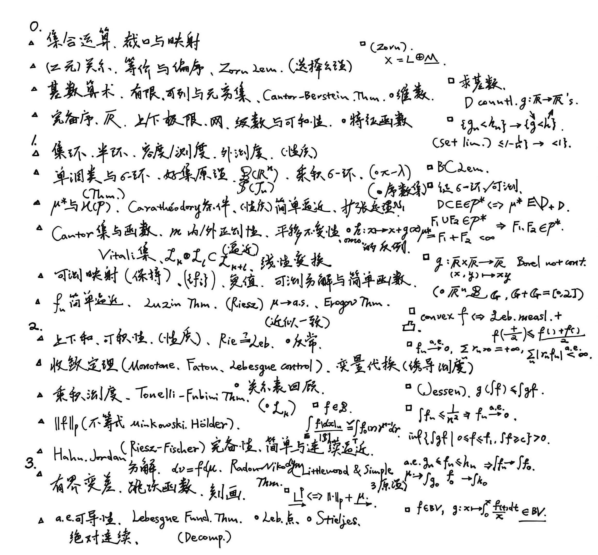



## 大纲

## 笔记

  <iframe src="./Zhi_notes.pdf"
          width="100%"
          height="800"
          style="border:1px solid #e5e7eb; border-radius:8px;"
          allowfullscreen>
    你的浏览器不支持内嵌 PDF，点击 <a href="./Zhi_notes.pdf">这里下载</a>。
  </iframe>

---

## 0 Set and Topology
## 1 Measures
## 2 Integration
## 3 Signed Measures and Differentiation
## 4 Functional Analysis, Lp Space and Radon measures
