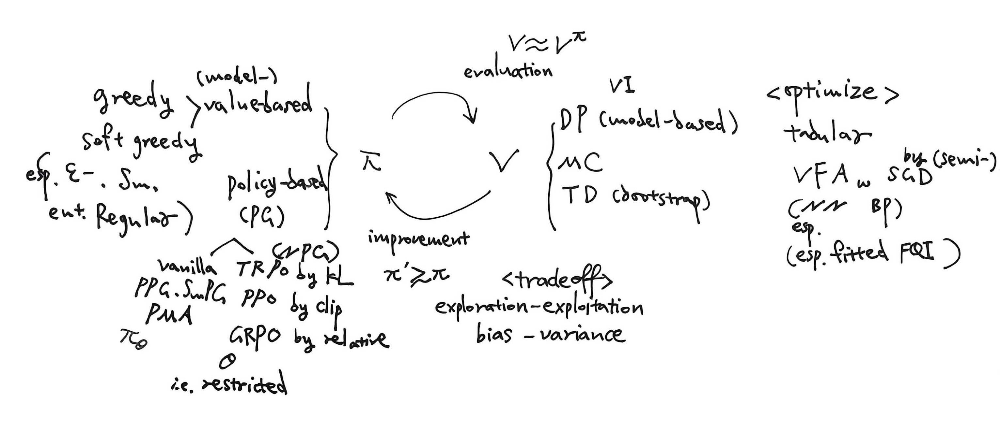



### Tables in RL for LLM

| Algorithm               | Token Advantage $\hat{A}\_k\left(s\_t^{(i j)}, a\_t^{(i j)}\right)$ |
| :---------------------- | :----------------------------------------------------------- |
| REINFORCE               | $r\left(x\_i, y\_{i j}\right)-\beta \sum\_{t^{\prime}=0}^{T\_{i j}-1} \log \frac{\pi\_{\theta\_k}\left(a\_{t^{\prime}}^{(i j)} \mid s\_{t^{\prime}}^{(i j)}\right)}{\pi\_{\text {ref }}\left(a\_{t^{\prime}}^{(i j)} \mid s\_{t^{\prime}}^{(i j)}\right)}$ |
| REINFORCE with KL trick | $r\left(x\_i, y\_{i j}\right)-\beta \sum\_{t^{\prime}=t}^{T\_{i j-1}-1} \log \frac{\pi\_{\theta\_k}\left(a\_{t^{\prime}}^{(i j)} \mid s\_{t^{\prime}}^{(i j)}\right)}{\pi\_{\text {ref }}\left(a\_{t^{\prime}}^{(i j)} \mid s\_{t^{\prime}}^{(i j)}\right)}$ |
| REINFORCE ++            | $r\left(x\_i, y\_{i j}\right)-\beta \sum\_{t^{\prime}=t}^{T\_{i j}-1} \log \frac{\pi\_{\theta\_k}\left(a\_{t^{\prime}}^{(i j)} \mid s\_{t^{\prime}}^{(i j)}\right)}{\pi\_{\text {ref }}\left(a\_{t^{\prime}}^{(i j)} \mid s\_{t^{\prime}}^{(i j)}\right)}$ with global batch normalization |
| RLOO                    | $R\_{i j}-\frac{1}{M-1} \sum\_{l \neq j} R\_{i j}$, where $R\_{i j}:=r\left(x\_i, y\_{i j}\right)-\beta \sum\_{t^{\prime}=0}^{T\_{i j}-1} \log \frac{\pi\_{\theta\_k}\left(a\_{t^{\prime}}^{(i j)} \mid s\_{t^{\prime}}^{(i j)}\right)}{\pi\_{\text {ref }}\left(a\_{t^{\prime}}^{(i j)} \mid s\_{t^{\prime}}^{(i j)}\right)}$ |
| REMAX                   | $r\left(x\_i, y\_{i j}\right)-r\left(x\_i, \hat{y}\_i\right)-\beta \sum\_{t^{\prime}=t}^{T\_{i j}-1} \log \frac{\pi\_{\theta\_k}\left(a\_{t^{\prime}}^{(i j)} \mid s\_{t^{\prime}}^{(i j)}\right)}{\pi\_{\text {ref }}\left(a\_{t^{\prime}}^{(i j)} \mid s\_{t^{\prime}}^{(i j)}\right)}$, where $\hat{y}\_i$ is sampled from greedy policy of $\theta\_k$ |
| PPO                     | $\begin{aligned} & \sum\_{t^{\prime}=t}^{T\_{i j}-1}(\lambda \gamma)^{t^{\prime}-t} \delta\_{t^{\prime}}^{(i j)} \text { where } \delta\_t^{(i j)}=\mathbb{I}\left\\{t=T\_{i j}-1\right\\} \cdot r\left(x\_i, y\_{i j}\right)- \\ & \beta \log \frac{\pi\_{\theta\_k}\left(a\_t^{(i j)} \mid s\_t^{(i j)}\right)}{\pi\_{\text {ref }}\left(a\_t^{(i j)} \mid s\_t^{(i j)}\right)}+\gamma V\_\phi\left(s\_{t+1}^{(i j)}\right)-V\_\phi\left(s\_t^{(i j)}\right) \end{aligned}$ |
| ORZ                     | $r\left(x\_i, y\_{i j}\right)-V\_\phi\left(s\_t^{(i j)}\right)$ (PPO with $\lambda=\gamma=1, \beta=0$ ) |
| GRPO (origin verson)    | $\frac{1}{T\_{i j}}\left[\frac{r\left(x\_i, y\_{i j}\right)-\text { mean }\left(\mathbb{R}\_i\right)}{\operatorname{std}\left(\mathbb{R}\_i\right)}+\beta\left(\frac{\pi\_{\text {ref }}\left(a\_t^{(i j)} \mid s\_t^{(i j)}\right)}{\pi\_{\theta\_k}\left(a\_t^{(i j)} \mid s\_t^{(i j)}\right)}-1\right)\right]$ |
| GRPO (R1 verson)        | $\frac{r\left(x\_i, y\_{i j}\right)-\text { mean }\left(\mathbb{R}\_i\right)}{\operatorname{std}\left(\mathbb{R}\_i\right)}+\beta\left(\frac{\pi\_{\text {ref }}\left(a\_t^{(i j)} \mid s\_t^{(i j)}\right)}{\pi\_{\theta\_k}\left(a\_t^{(i j)} \mid s\_t^{(i j)}\right)}-1\right)$ |
| DAPO                    | $\frac{1}{\hat{T}\_i}\left[\frac{r\left(x\_i, y\_{i j}\right)-\operatorname{mean}\left(\mathbb{R}\_i\right)}{\operatorname{std}\left(\mathbb{R}\_i\right)}\right]$, where $\hat{T}\_i=\frac{1}{M} \sum\_{j=1}^M T\_{i j}$. |
| DR.GRPO                 | $r\left(x\_i, y\_{i j}\right)-\operatorname{mean}\left(\mathbb{R}\_i\right)$ |

| Algorithm             | Token Advantage $\hat{A}\_k\left(s\_t^{(i j)}, a\_t^{(i j)}\right)$ $(r(x\_i,y\_{ij})\in \\{0,1\\},\ \beta = 0)$ | Expectation of Token Advantage $\mathbb{E}\left[\hat{A}\_k\left(s\_t^{(i j)}, a\_t^{(i j)}\right) \mid\left(s\_t^{(i j)}, a\_t^{(i j)}\right)\right]$ | Expectation of the Gradient of Policy Loss $\mathbb{E}\_{\mathbb{X}, \mathbb{Y}}\left[\nabla\_\theta \hat{\mathcal{L}}\left(\theta\_k\right)\right]$ |
| :-------------------- | :----------------------------------------------------------- | :----------------------------------------------------------- | :----------------------------------------------------------- |
| REINFORCE             | $r\left(x\_i, y\_{i j}\right)$                                 | $Q^{\pi\_{\theta\_k}}\left(s\_t^{(i j)}, a\_t^{(i j)}\right)$    | $-\nabla\_\theta \mathcal{J}\left(\theta\_k\right)$            |
| REINFORCE ++          | $\frac{1}{\operatorname{std}(\mathbb{R})}\left[r\left(x\_i, y\_{i j}\right)-\operatorname{mean}(\mathbb{R})\right]$ | $\frac{1}{\sigma\_k}\left(Q^{\pi\_{\theta\_k}}\left(s\_t^{(i j)}, a\_t^{(i j)}\right)-\mu\_k\right)$ | $-\frac{1}{\sigma\_k} \nabla\_\theta \mathcal{J}\left(\theta\_k\right)$ asymptotically as $NM$ is large enough |
| RLOO                  | $r\left(x\_i, y\_{i j}\right)-\frac{1}{M-1} \sum\_{l \neq j} r\left(x\_i, y\_{i l}\right)$ | $Q^{\pi\_{\theta\_k}}\left(s\_t^{(i j)}, a\_t^{(i j)}\right)-V^{\pi\_{\theta\_k}}\left(x\_i\right)$ | $-\nabla\_\theta \mathcal{J}\left(\theta\_k\right)$            |
| REMAX                 | $r\left(x\_i, y\_{i j}\right)-r\left(x\_i, \hat{y}\_i\right)$, where $\hat{y}\_i$ is sampled from the greedy policy of $\hat{\pi}\_{\theta\_k}$ | $Q^{\pi\_{\theta\_k}}\left(s\_t^{(i j)}, a\_t^{(i j)}\right)-V^{\hat{\pi}\_{\theta\_k}}\left(x\_i\right)$ | $-\nabla\_\theta \mathcal{J}\left(\theta\_k\right)$            |
| PPO                   | $\begin{aligned} & (\lambda \gamma)^{T\_{i j}-1-t} r\left(x\_i, y\_{i j}\right)+ \\ & \sum\_{t^{\prime}=t+1}^{T\_{i j}-1}\left(\frac{1}{\lambda}-1\right)(\lambda \gamma)^{t^{\prime}-t} V\_\phi\left(s\_{t^{\prime}}^{(i j)}\right)-V\_\phi\left(s\_t^{(i j)}\right) \end{aligned}$ | $A\_{\lambda, \gamma}^{\pi\_{\theta\_k}}\left(s\_t^{(i j)}, a\_t^{(i j)}\right)$. If $V\_\phi=V^{\pi\_{\theta\_k}}$ and $\gamma=1, A\_{\lambda, \gamma}^{\pi\_{\theta\_k}}\left(s\_t^{(i j)}, a\_t^{(i j)}\right)= A^{\pi\_{\theta\_k}}\left(s\_t^{(i j)}, a\_t^{(i j)}\right)$ | $-\nabla\_\theta \mathcal{J}\left(\theta\_k\right)$ If $V\_\phi=V^{\pi\_{\theta\_k}}$ and $\gamma=1$. |
| ORZ                   | $r\left(x\_i, y\_{i j}\right)-V\_\phi\left(s\_t^{(i j)}\right)$ (PPO with $\lambda=\gamma=1$ ) | $Q^{\pi\_{\theta\_k}}\left(s\_t^{(i j)}, a\_t^{(i j)}\right)-V\_\phi\left(s\_t^{(i j)}\right)$ | $-\nabla\_\theta \mathcal{J}\left(\theta\_k\right)$            |
| GRPO (origin version) | $\frac{1}{T\_{i j}}\left[\frac{r\left(x\_i, y\_{i j}\right)-\hat{p}\_i}{\sqrt{\hat{p}\_i\left(1-\hat{p}\_i\right)}}\right]$ | Hard to analyze due to the length normalization term $\frac{1}{T\_{i j}}$ | $-\mathbb{E}\_{x \sim \mathcal{D}, y \sim \pi\_{\theta\_k}}(\cdot \mid x)\left[\frac{r(x, y) \nabla\_\theta \log \pi\_{\theta\_k}(x, y)}{T \sqrt{p\_{\theta\_k}(x)\left(1-p\_{\theta\_k}(x)\right)}}\right] \neq$   $-\nabla\_\theta \mathcal{J}\left(\theta\_k\right)$ asymptotically as $M$ is large enough |
| GRPO (R1 version)     | $\frac{r\left(x\_i, y\_{i j}\right)-\hat{p}\_i}{\sqrt{\hat{p}\_i\left(1-\hat{p}\_i\right)}}$ | $\frac{Q^{\pi\_{\theta\_k}}\left(s\_t^{(i j)}, a\_t^{(i j)}\right)-p\_{\theta\_k}\left(x\_i\right)}{ \sqrt{p\_{\theta\_k}\left(x\_i\right) (1-p\_{\theta\_k}\left(x\_i\right))}}$ asymptotically as $M$ is large enough | $-\mathbb{E}\_{x \sim \mathcal{D}, y \sim \pi\_{\theta\_k}}(\cdot \mid x)\left[\frac{r(x, y) \nabla\_\theta \log \pi\_{\theta\_k}(x, y)}{\sqrt{p\_{\theta\_k}(x)\left(1-p\_{\theta\_k}(x)\right)}}\right] \neq$   $-\nabla\_\theta \mathcal{J}\left(\theta\_k\right)$ asymptotically as $M$ is large enough |
| DAPO                  | $\frac{1}{\hat{T}\_i}\left[\frac{r\left(x\_i, y\_{i j}\right)-\hat{p}\_i}{\sqrt{\hat{p}\_i\left(1-\hat{p}\_i\right)}}\right]$, where $\hat{T}\_i=\frac{1}{M} \sum\_{j=1}^M T\_{i j}$ | $\frac{Q^{\pi\_{\theta\_k}}\left(s\_t^{(i j)}, a\_t^{(i j)}\right)-p\_{\theta\_k}\left(x\_i\right)}{T\_{\theta\_k}\left(x\_i\right) \sqrt{p\_{\theta\_k}\left(x\_i\right) (1-p\_{\theta\_k}\left(x\_i\right))}}$ asymptotically as $M$ is large enough | $-\mathbb{E}\_{x \sim \mathcal{D}, y \sim \pi\_{\theta\_k}(\cdot \mid x)}\left[\frac{r(x, y) \nabla\_\theta \log \pi\_{\theta\_k}(x, y)}{T\_{\theta\_k}(x) \cdot \sqrt{p\_{\theta\_k}(x)\left(1-p\_{\theta\_k}(x)\right)}}\right] \neq -\nabla\_\theta \mathcal{J}\left(\theta\_k\right)$ asymptotically as $M$ is large enough |
| DR.GRPO               | $r\left(x\_i, y\_{i j}\right)-\hat{p}\_i$                       | $\frac{M-1}{M}\left(Q^{\pi\_{\theta\_k}}\left(s\_t^{(i j)}, a\_t^{(i j)}\right)-V^{\pi\_{\theta\_k}}\left(x\_i\right)\right)$ | $-\frac{M-1}{M} \nabla\_\theta \mathcal{J}\left(\theta\_k\right)$ |

- REINFORCE ++ 和 DR. GRPO 隐式的采用了自适应的学习率。REINFORCE++ 是由于 global batch normalization，DR.GRPO 是由于没有留一。

- GRPO (original/R1 version) 和 DAPO 的期望梯度并不是真实的策略梯度。且梯度中渐进存在 $\frac{1}{\sqrt{p\_{\theta\_k}\left(x\_i\right) (1-p\_{\theta\_k}\left(x\_i\right))}} $这一项，因此更偏好学习简单和难的题目（梯度权重更大）；由于 GRPO (original version) 中 $\frac{1}{T}$ 的长度正则项的存在，可能更倾向于输出短而正确的答案；由于 DAPO 中 $\frac{1}{T\_{\theta\_k}\left(x\_i\right)}$ 的存在，更倾向于在输出平均长度更短的 prompt 的数据上进行学习。

- 假设 $\lambda \gamma<1$ ，当 $t \rightarrow 0, ~(\lambda \gamma)^{T\_{i j}-1-t} \rightarrow 0$。PPO 中的 Q 值估计
  $$
  \hat{Q}\left(s\_t^{(i j)}, a\_t^{(i j)}\right):=(\lambda \gamma)^{T\_{i j}-1-t} r\left(x\_i, y\_{i j}\right)+\sum\_{t^{\prime}=t+1}^{T\_{i j}-1}\left(\frac{1}{\lambda}-1\right)(\lambda \gamma)^{t^{\prime}-t} V\_\phi\left(s\_{t^{\prime}}^{(i j)}\right)
  $$
  其中 critic 的输出 $V\_\phi\left(s\_{t^{\prime}}^{(i j)}\right)$ 将会占据主导，因此如果 $V\_\phi\left(s\_{t^{\prime}}^{(i j)}\right)$ 不佳（PPO 训练的关键）将会产生非常大的 bias。ORZ 通过采用 $\lambda=\gamma=1$，Q 值的估计将不受 critic 影响从而不产生 bias。

- $\hat{A}\_k\left(s\_t^{(i j)}, a\_t^{(i j)}\right)$（作为 token 梯度向量 $\nabla\_\theta \log \pi\_{\theta\_k}(x, y)$ 的权重出现）的符号近似表明了该 token 处的概率输出值的增减方向。REINFORCE（没有使用 baseline 项）会尝试增加所有采集到的 token 的概率，无论答案是否正确，因此存在较大的方差。

- 除 PPO 外，所有算法都使用 $r(x\_i,y\_{ij})$ 作为 MC $Q$ 估计值，在答案正确时通常会尝试增加 token 概率而在错误时降低 token 概率，在减小方差方面无本质差异。 $r(x\_i,y\_{ij})$ 作为 $Q$ 估计确实会引入训练方差，因为轨迹的最终奖励 $r(x\_i,y\_{ij})$ 可能与 token 真实的 advantage $\hat{A}\_k\left(s\_t^{(i j)}, a\_t^{(i j)}\right)$ 的符号不匹配（可能答案正确但过程包含模型易犯错的推理步骤，反之也存在最终答案错误但包含好的推理步骤的轨迹）。

- 除了 PPO 和 ORZ 外，其他所有算法每个状态动作对的 baseline 项（如 $V^{\pi\_{\theta\_k}}\left(x\_i\right)$）都至多是 prompt 级别的。从方差的角度考虑，每个 token 都应该用自己的 $V^{\pi\_{\theta\_k}}\left(s\_t^{(ij)}\right)$ 作为 baseline 项。在二元奖励下，由于ORZ 放弃了使用 critic 对 $Q$ 进行估计，使得虽然 baseline 使用了 $V\_{\phi}\left(s\_t^{(ij)}\right)$，但实质上只调整了不同 token处的 advantage 的 scale（符号仍和最终轨迹奖励相匹配）。因此从某种程度上来说，只有 PPO 能够实现token-level 的精细策略优化。

---

### 笔记

#### Mind Map

#### 1 Settings
#### 2 Evaluation
#### 3 Value Approximation
#### 4 Policy Gradient
#### 5 Online Planning
#### 6 RL for LLM
#### 7 Meta RL

  <iframe src="./RL_scripts.pdf"
          width="100%"
          height="800"
          style="border:1px solid #e5e7eb; border-radius:8px;"
          allowfullscreen>
    你的浏览器不支持内嵌 PDF，点击 <a href="./RL_scripts.pdf">这里下载</a>。
  </iframe>

