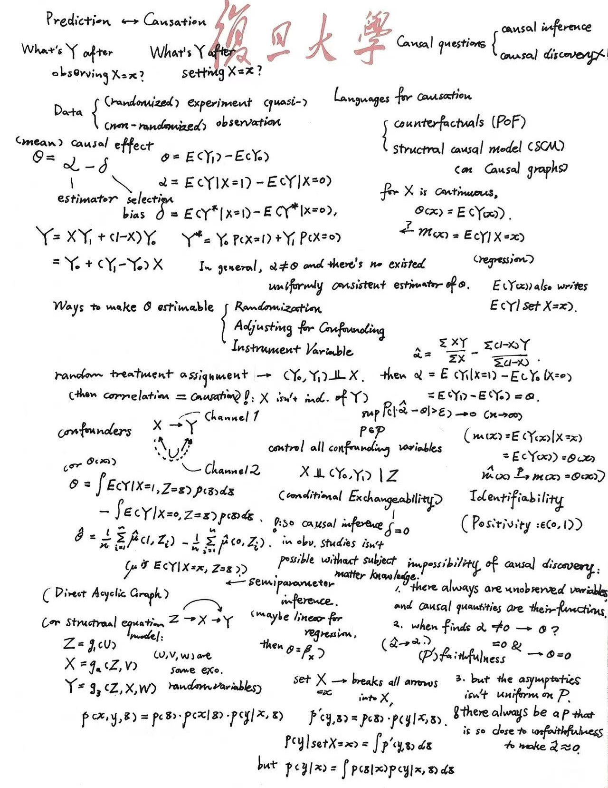



## 统计推断

## 多元统计

  <iframe src="./multistat_o.pdf"
          width="100%"
          height="800"
          style="border:1px solid #e5e7eb; border-radius:8px;"
          allowfullscreen>
    你的浏览器不支持内嵌 PDF，点击 <a href="./multistat_o.pdf">这里下载</a>。
  </iframe>

## 因果推断

## 非参数统计

  <iframe src="./nonpara.pdf"
          width="100%"
          height="800"
          style="border:1px solid #e5e7eb; border-radius:8px;"
          allowfullscreen>
    你的浏览器不支持内嵌 PDF，点击 <a href="./nonpara.pdf">这里下载</a>。
  </iframe>

