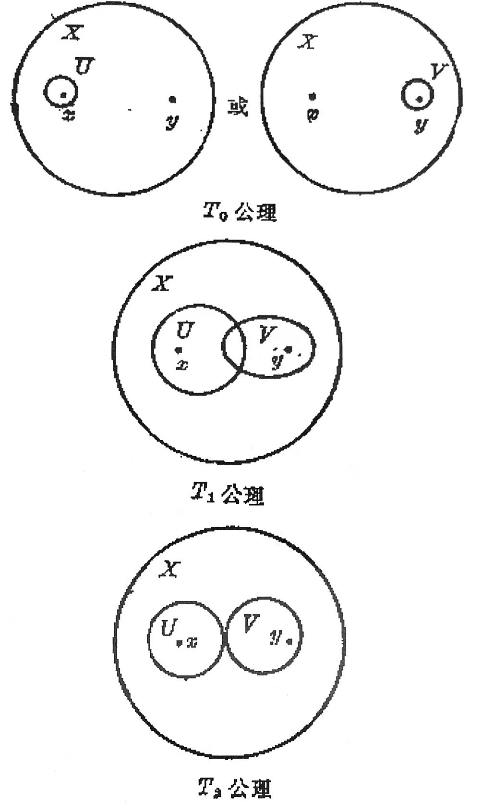
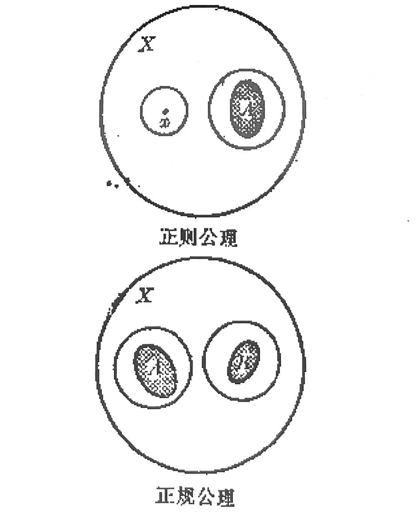
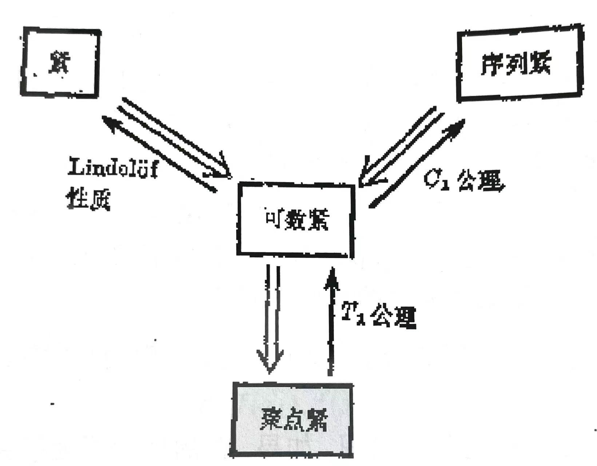
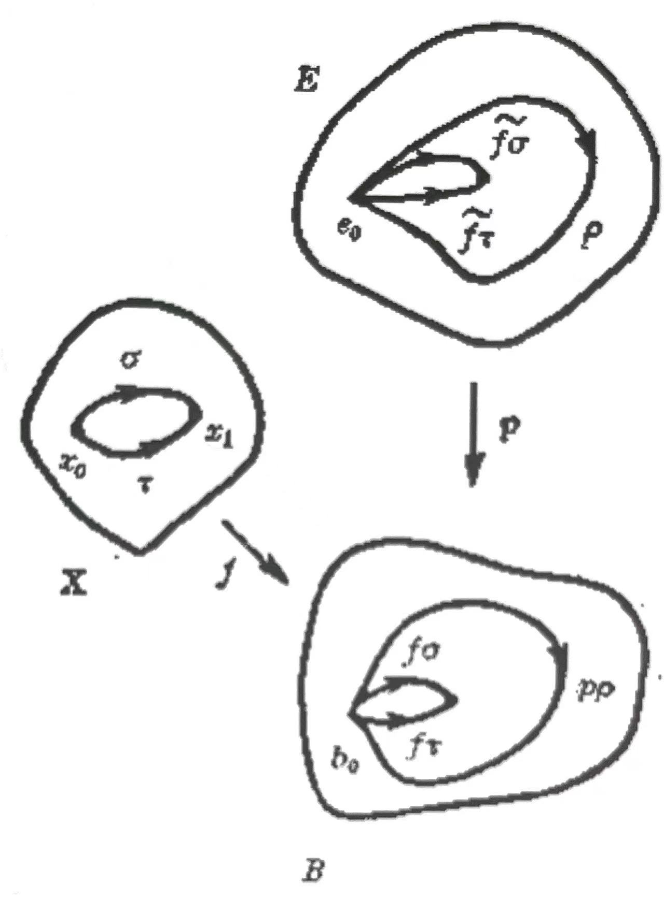
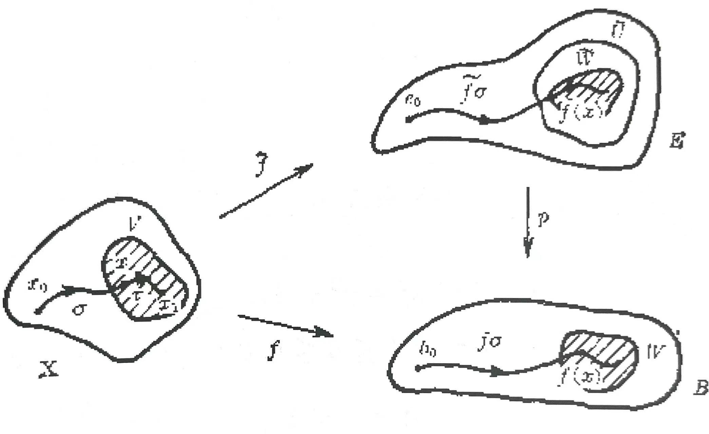


## 大纲
### Part 1

邻域系 $\mathcal{N}(x)$  Kuratowski 闭包公理  导集 完全集  子基 局部基

积拓扑与盒拓扑 $\mathscr{S}=\{p^{-1}\_\lambda(U\_\lambda)|U\_\lambda\in \mathscr{S}\_\lambda,\lambda\in \Lambda \}$  有向集 网的收敛 $\forall x \in \bar{A},\ \exist \{x\_\alpha|\alpha\in D\}\rightarrow x$

可数公理 分离公理 ($C\_1$: 序列 ex. 度量；$C\_2$: 可分 ex. 可分度量) ($T\_1$: 单点闭；$T\_2$: 网收敛于同一点；$T\_4$: ex. 度量)

正规空间与 Urysohn 引理、Tietze 扩张 (闭集)

Tychonoff 定理 (管状邻域引理、Lebesgue 覆盖引理)

可数紧  Lindelof 空间 ($C\_2\Rightarrow$)  列紧 ($C\_1$+可数紧)  聚点紧 (+$T\_1\Rightarrow$​ 可数紧) (Bolzano-Weierstrass 定理)

完全有界 (+闭, 度量: 紧) 完备度量空间 (Cauchy 序列)  单点紧化 (局部紧$T\_2\rightarrow$ 紧$T\_2$)

(紧: 极值、一致连续、交性质；连通：介值；局部连通：开集分支开) ($T\_2$+紧: $T\_4$；$T\_2$+局部紧: $T\_3$​)

Urysohn 度量化定理 ($C\_2+T\_3\Rightarrow T\_4$) (Hilbert 方体)  Nagata-Smirnov 度量化定理 ($\sigma$​-局部有限)

单位分解  仿紧  流形的嵌入  函数空间 (点态收敛拓扑、紧开拓扑) $Y^X=\prod\limits\_{x\in X} Y\_x = \{f:X\rightarrow \bigcup\limits\_{x\in X}Y\_x| f(x)\in Y\_x=Y \}$

 

### Part 2

收缩核 形变收缩核 强形变收缩核

度数 $\deg \sigma=\tilde{\sigma}(1),\ \sigma\in \Omega(S^1,1)$  代数基本定理的证明、Brouwer 不动点定理的证明

底空间 基本邻域 覆盖射影  叶/层数 $\lvert p^{-1}(b)\rvert$

覆盖道路性质、覆盖同伦性质与映射提升定理 $\exist \text{ cont.}f,\ p\tilde{f}=f \Leftrightarrow f\_\*\pi\_1(X,x\_0)\subset p\_\*\pi\_1(E,e\_0)$

子群共轭类 (示性类) $\\{p\_\*\pi\_1(E,e)|e\in p^{-1}(b\_0) \\}$  覆盖同构 $p\_2h=p\_1$  分类定理

(半局部连通 $\Rightarrow$) 存在性定理 $H\subset \pi\_1(B,b\_0),\ \exist E,\ p:E\rightarrow B,\text{ s.t. }e\_0\in p^{-1}(b\_0),\ p\_\*(\pi\_1(E,e\_0))=H$

万有覆盖空间 (任何覆盖空间的正则覆盖) $\\{0\\}$  覆盖变换群 (自同构群) $A(E,p)\cong \pi\_1(B,b\_0)/p\_\*\pi\_1(E,e\_0)$​

$$
\Large
\begin{CD}
    X @\> \tilde{f} \>\> E \\\
    @| @ VV\{p\ (p_*\text{ inj.})\}V\\\
    X @\>\> f \> B
\end{CD}
$$

         

---

## 笔记

  <iframe src="./topology.pdf"
          width="100%"
          height="800"
          style="border:1px solid #e5e7eb; border-radius:8px;"
          allowfullscreen>
    你的浏览器不支持内嵌 PDF，点击 <a href="./topology.pdf">这里下载</a>。
  </iframe>

---

书目：

- Armstrong
- 尤承业
- 李元熹
- Munkres
