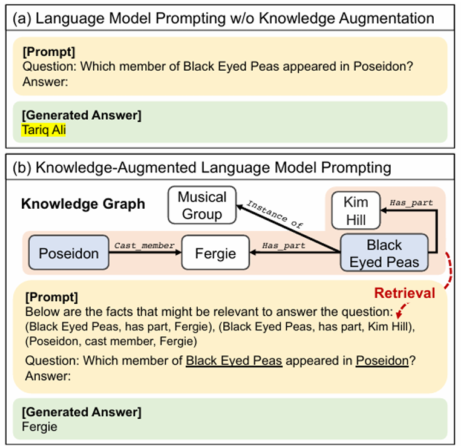
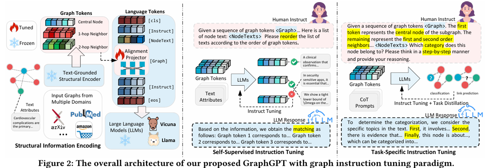
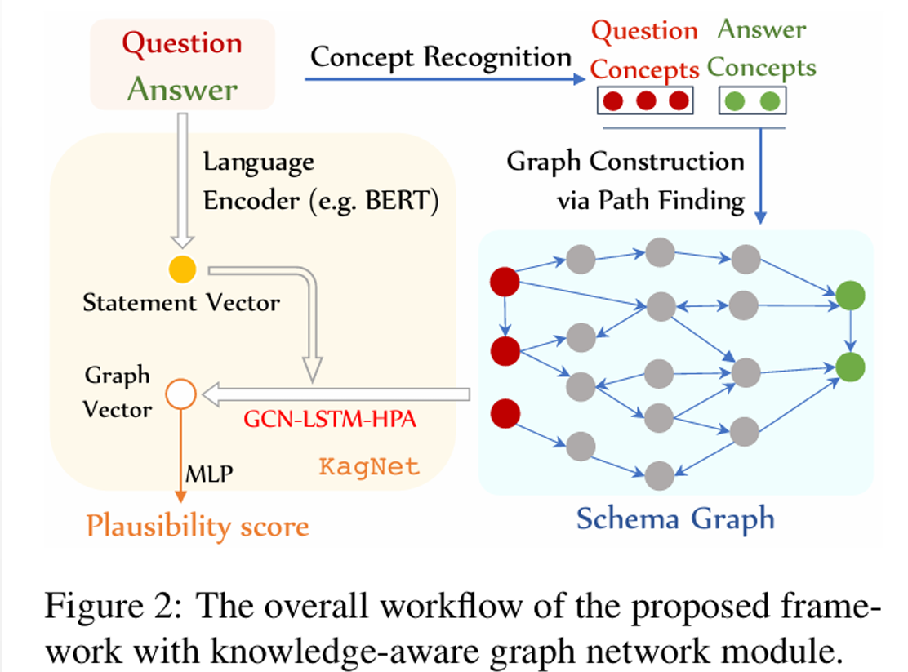
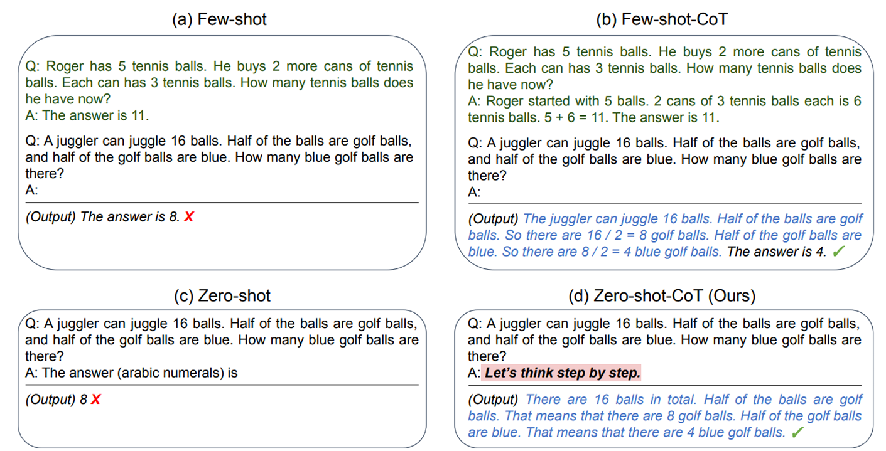
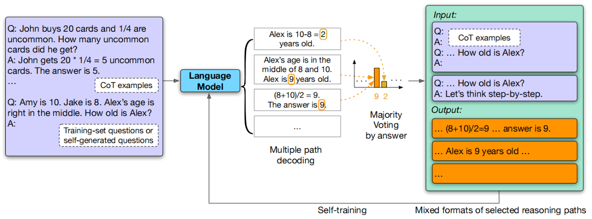
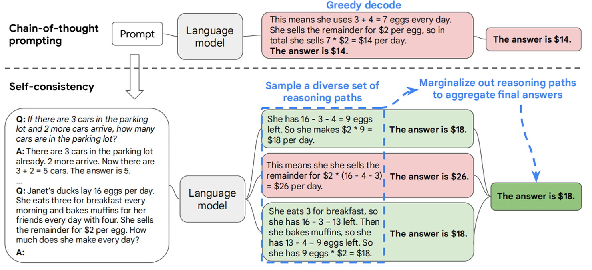



## Does It Make Sense? And why? A Pilot Study for Sense Making and Explanation

Cunxiang Wang, Shuailong Liang, Yue Zhang, Xiaonan Li and Tian Gao

> Introducing common sense to natural language understanding systems has received increasing research attention. It remains a fundamental question on how to evaluate whether a system has a sense making capability. Existing bench marks measures commonsense knowledge in directly and without explanation. In this paper, we release a benchmark to directly test whether a system can differentiate natural language statements that make sense from those that do not makesense. In addition, a system is asked to identify the most crucial reason why a statement does not make sense. We evaluate models trained over large-scale language modeling tasks as well as human performance, showing that there are different challenges for system sense making.

### 示例

- Statement 1: He put a turkey into the fridge.\
  Statement 2: He put an elephant into the fridge.（违背常识）

    输入：两个在词汇上相似的句子（sent0, sent1）\
    输出：一个标签（0 或 1 分别表示 sent0 或 sent1 违背常识）

- Statement：他把一头大象放进了冰箱。\
  Reason:\
    A：一头大象比冰箱大得多。（正确解释）\
    B：大象通常是白色的，而冰箱通常也是白色的。\
    C：大象不能吃掉冰箱。

    输入：一句违背常识的陈述和三个解释选项。\
    输出：A、B 或 C（表示选择最合理的解释）

### 实现方式

#### Sense-Making

选择 score 较低的作为符合常识的语句。
1. BERT：对于所有 token，将该 token 替换为 mask，模型输出 logits 得到预测分布
2. GPT2：用前缀预测下一个 token，直接给出 $\mathrm{P}\left(w\_{\mathrm{i}} \mid w\_{i+1}\right)$

$$
\begin{aligned}
& \operatorname{score}\_{\mathrm{BERT}}=\left(p\_{w\_1} \* p\_{w\_2} \* \ldots \* p\_{w\_n}\right)^{(-1 / n)}= \\\
& \quad\left(\prod\_{i=1}^n P\left(w\_i \mid w\_1 \ldots w\_{i-1} w\_{i+1} \ldots w\_n\right)\right)^{-1 / n} \\\
& \quad \operatorname{score}\_{\mathrm{GPT}}=\left(p\_{w\_1} \* p\_{w\_2} \* \ldots \* p\_{w\_n}\right)^{(-1 / n)}= \\\
& \quad\left(\prod\_{i=1}^n P\left(w\_i \mid w\_1 \ldots w\_{i-1}\right)\right)^{-1 / n}=P\left(w\_1 \ldots w\_n\right)^{-1 / n}
\end{aligned}
$$

3. ELMO：

| 标准名称 | 核心判断依据 | 计算公式 |
| :--- | :--- | :--- |
| L2 范数比较 | ELMO 向量的欧几里得长度 | `np.linalg.norm(emb)` |
| 与零向量余弦相似度 | 句向量与零向量的方向一致性 | $\cos (\theta)=(\mathrm{emb} \cdot \theta) /(\\|\mathrm{emb}\\|\\|\theta\\|)$ |
| 双向 LSTM 余弦相似度 | Forward／Backward LSTM 向量的方向一致性 | $\cos (\mathrm{fw}, \mathrm{bw})$ |
| 双向 LSTM 欧氏距离 | Forward／Backward LSTM 向量的几何距离 | $\\|\mathrm{fw}-\mathrm{bw}\\| 2$ |

#### Reason Explaination

1. BERT/GPT2: 选择使组合句子概率最大的解释
2. ELMO: L2 范数/余弦相似度

```Python
# map to ids
tokens = bert_tokenizer.tokenize(sentence)
token_ids = bert_tokenizer.convert_tokens_to_ids(tokens)
input_ids = [bert_tokenizer.cls_token_id] + token_ids + [bert_tokenizer.sep_token_id]
seq_len = len(input_ids)
# input_ids_tensor = torch.tensor([input_ids]).to(self.device)

# log score = -1/n * sum(log p_wi)
log_probs = []
mask_token_id = bert_tokenizer.mask_token_id

for i in range(1, seq_len-1):
    # mask the i-th token(id w_i)
    masked_input_ids = input_ids.copy()
    masked_input_ids[i] = mask_token_id
    masked_input_ids_tensor = torch.tensor([masked_input_ids]).to(self.device)

    with torch.no_grad():
        outputs = bert_model(masked_input_ids_tensor)
        logits = outputs.logits # (batch_size, seq_len, vocab_size)

    # (vocab_size,)
    mask_logits = logits[0, i]
    probs = F.softmax(mask_logits, dim=-1)

    w_i = input_ids[i]
    p_wi = probs[w_i]
    log_probs.append(torch.log(p_wi + 1e-10)) # avoid log(0)

log_score = -torch.tensor(log_probs).mean()
score = torch.exp(log_score)
```

### 复现

按上节方法结果如下：

| Model | Sen-Making | Explanation |
| :---: | :--------: | :---------: |
| BERT  |   69.57%   |   37.41%    |
| ELMo  |    62%     |     40%     |
| GPT-2 |   69.97%   |   36.07%    |

论文结果：

| Model | Sen-Making | Explanation |
| :--- | :--- | :--- |
| Random | 50.0% | 33.3% |
| ELMo | 69.4% | 33.4% |
| BERT | 70.1% | 45.6% |
| fine-tuned ELMo | 74.1% | 34.6% |
| Human Performance | 99.1% | 97.8% |

### 改进

#### 知识图谱 KG

KG 主要涉及到如下方面：

- 数据增强（三元组自然描述）
- 结构融合（KG 嵌入（拼接、加权、注意力学习），GNN）
- 训练优化（KG 对齐损失，多任务学习，基于知识奖励 RL）
- 指令微调（扩充问题）

**Knowledge-Augmented Language Model Prompting for Zero-Shot Knowledge Graph Question Answering**

Jinheon Baek, Alham Fikri Aji and Amir Saffari



**NER + Concat + Score**

```Python
def get_all_conceptnet_relations(entities):
    relations = []
    if len(entities) < 2:
        return relations
    for i in range(len(entities)):
        for j in range(i + 1, len(entities)):
            start_node = entities[i].lower().replace(" ", "_")
            end_node = entities[j].lower().replace(" ", "_")
            url = f"http://api.conceptnet.io/query?node1=/c/en/{start_node}&node2=/c/en/{end_node}&rel=/r/RelatedTo"
            try:
                response = requests.get(url, timeout=5)
                data = response.json()
                if data["edges"]:
                    for edge in data["edges"]:
                        relation = edge["rel"]["label"]
                        relations.append(f"{end_node} is related to {start_node} via {relation}.")
            except Exception as e:
                print(f"ConceptNet error for {start_node} and {end_node}: {e}")
                relations.append(f"{end_node} is related to {start_node} via related to.")
    return relations
```

**结果：61.08%，40.08%**

知识图谱的效果非常依赖于常识问题与知识库关联的紧密度，提升有限，大概率不如 COT。

**GraphGPT: Graph Instruction Tuning for Large Language Models**

Jiabin Tang, Yuhao Yang and Wei Wei



**KagNet: Knowledge-Aware Graph Networks for Commonsense Reasoning**

Bill Yuchen Lin, Xinyue Chen, Jamin Chen and Xiang Ren

在 CommonsenseQA 数据集上，KagNet 结合 BERT-LARGE 实现了当时（2019年5月）的最优性能（OFtest 准确率 58.9%）。



上下文嵌入概念 - 编码路径中的多跳关系\
层次注意力机制选择重要路径和概念对

#### 思维链 CoT

**Large Language Models are Zero-Shot Reasoners**

Takeshi Kojima, Shixiang Shane Gu, Machel Reid, Yutaka Matsuo and Yusuke Iwasawa

**Zero-shot-CoT**

```Python
def sen_making_prompt(s1, s2):
    return f"""### Instruction:
Which of the following two statements makes more sense?

Statement A: {s1}
Statement B: {s2}

Let's think step by step.

### Response:
"""
```



**Large Language Models Can Self-Improve**

Jiaxin Huang, Shixiang Shane Gu, Le Hou, Yuexin Wu, Xuezhi Wang, Hongkun Yu and Jiawei Han

输入阶段：输入给语言模型带有详细推理步骤的问题答案和目标问题，用于生成答案。

推理与投票阶段：语言对目标问题进行多路径解码，通过 majority voting 按答案聚合，所有产生该答案的路径被选为可靠训练样本。

自我训练阶段：选出的推理路径作为新的训练数据。



**Self-Consistency Improves Chain of Thought Reasoning in Language Models**

Xuezhi Wang, Jason Wei, Dale Schuurmans, Quoc Le, Ed Chi, Sharan Narang, Aakanksha Chowdhery and Denny Zhou


